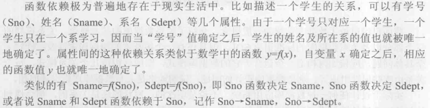

# 绪论

> 数据与语义不可分

## 概念

数据库系统=DB DBMS Apps DBA组成的数据管理系统

| 概念                                                        | 定义                                                 | 特征                   |
| ----------------------------------------------------------- | ---------------------------------------------------- | ---------------------- |
| 数据（data）                                                | 描述事物的符号记录                                   | 与自身语义不可分       |
| 数据库（database, [DB](#DB)）                               | 长期储存在计算机内、有组织的、可共享的大量数据的集合 | 永久存储 有组织 可共享 |
| 数据库管理系统（database management system, [DBMS](#DBMS)） | 数据管理工具                                         |                        |
| 数据库系统(DataBase System, DBS)                            | DB DBMS App DBA组成的数据管理系统                    |                        |

两类数据模型

- 概念模型 conceptual model
  - 信息模型（别名）
  - 用于数据库设计
- 逻辑模型（第二类）
  -   包含多种模型
      -   层次模型（hierarchical model）
      -   网状模型（network model）
      -   关系模型（relational model）
  -   主要用于数据库管理系统的实现
- 物理模型（第二类）
  -   对数据最底层的抽象
  -   数据在系统内部的表示方式和存取方法


信息世界概念

| 概念    |              | 解释                                 |
| ------- | ------------ | ------------------------------------ |
| 实体    | entity       | 客观存在并可相互区别的事物           |
| 属性    | attribute    | 实体所具有的某一特性                 |
| 码/主键 | key          | 唯一标识实体的属性集                 |
| 实体型  | entity type  | 用实体名及其属性名集合来抽象同类实体 |
| 实体集  | entity set   | 同一类型实体的集合                   |
| 联系    | relationship | 1v1/1vN/NvN                          |

关系模型概念

| 术语         |              | 含义                            |
| ------------ | ------------ | ------------------------------- |
| 关系         | relationship | 一个关系对应通常说的一-张表     |
| 元组         | tuple        | 表中的一行                      |
| 属性         | attribute    | 表中的一列                      |
| 码           | key          | 某个属性组 可以唯一确定一个元组 |
| 域           | domain       | 一组具有相同数据类型的值的集合  |
| 分量         | component    | 元组中的一个属性值              |
| 非规范化关系 |              | 表中有表（嵌套）                |
| 关系模式     |              | 对关系的描述（语义              |

## 结构


三级结构：模式 外模式 内模式


模式：schema 逻辑模式

-   数据库中**全体**数据的逻辑结构和特征的描述
-   中间层/逻辑级视图
-   所有用户的公共数据视图


外模式：subschema 用户模式

-   数据库用户(包括应用程序员和最终用户)能够看见和使用的**局部**数据的逻辑结构和特征的描述
-   数据库用户的数据视图
-   与某一应用有关的数据的逻辑表示
-   应用程序编写的根据


内模式：storage schema 存储模式

-   数据物理结构和存储方式的描述
-   数据在数据库内部的组织方式


| 独立性     | 逻辑独立性             | 物理独立性             |
| ---------- | ---------------------- | ---------------------- |
| 体现       | 数据与程序的逻辑独立性 | 数据与程序的物理独立性 |
| 依赖映像   | 外模式/模式            | 模式/内模式            |
| 改变的结构 | 模式                   | 存储结构               |

# 关系数据库

> 关系模型=关系数据结构+关系操作集合+关系完整性约束

## 定义

| 概念     |                   | 定义                                      | 补充                        |
| -------- | ----------------- | ----------------------------------------- | --------------------------- |
| 域       | domain            | 一组具有相同数据类型的值的集合            | 1..99                       |
| 笛卡尔积 | cartesian product |                                           | Card(D)=$\prod_{i=1}^n d_i$ |
| 元组     | tuple             | 笛卡尔积的元素                            | n-tuple                     |
| 关系     | relation          | 笛卡尔积的有限子集                        |                             |
| 候选码   | candidate key     | 属性组的值能唯一标识一个元组 而其子集不能 |                             |

> 关系操作的特点是集合操作

关系模式是关系的描述

`R(U,D,DOM,F)` 是形式化表示

| 字母 | 含义                     |
| ---- | ------------------------ |
| R    | 关系名                   |
| U    | 组成关系的属性名集合     |
| D    | U的域                    |
| DOM  | 属性向域的映射关系       |
| F    | 属性间数据的依赖关系集合 |

## 完整性

本关系中对应其他关系主码的属性称为外码

| 实体完整性规则   | 参照完整性                 | 用户定义的完整性                       |
| ---------------- | -------------------------- | -------------------------------------- |
| 主属性不能为null | 外码为null或存在的对应主码 |                                        |
| 针对于基本关系   | 外码的参照关系/定义外码    | 关系模型提供定义和检验这类完整性的机制 |

## 关系代数

>   对关系的运算来表达查询


### 传统集合运算

>   并 差 交 笛卡尔积

| 关系                                 | 符号     | 表示                                               |
| ------------------------------------ | -------- | -------------------------------------------------- |
| 并 union                             | $\cup$   | $R\cup S=\{t|t\in R\or t\in S\}$                   |
| 差 except                            | -        | $R-S=\{t|t\in R\and t\notin S\}$                   |
| 交 intersection                      | $\cap$   | $R\cap S=\{t|t∈R∧t∈S\}$                            |
| 笛卡儿积 [extended]Cartesian product | $\times$ | $R\times S]\{\hat{t_rt_s}|t_r\in R\and t_s\in S\}$ |


### 关系运算符

>   选择 投影 连接 除运算


<center>符号引入</center>

| 关系 | 表示                                                         |
| ---- | ------------------------------------------------------------ |
| 选择 | $\sigma_F(R)=\{t|t\in R\and F(t)=True\}$                     |
| 投影 | $\Pi_A(R)=\{t[A]|t\in R\}$                                   |
| 连接 | $R\bowtie S=\{\hat{t_rt_s}|t_r\in R\and t_s\in S\and t_r[A]\theta t_s[B]\}$ |
| 除   | $R\div S=\{t_r[X]|t_r\in R\and\Pi_y(S)\subseteq Y_x\}$       |


#### 选择

>   也称限制(restriction)

$\sigma_F(R)=\{t|t\in R\and F(t)=True\}$

F表示选择条件 $F_i:=False|True$

逻辑表达式F的基本形式为 $X_i\theta Y_i$  $\theta$为比较运算符

####  投影

>   projecting

$\Pi_A(R)=\{t[A]|t\in R\}$

从R中选择出若干属性列组成新的关系

#### 连接

>   join $\bowtie$

$R\bowtie S=\{\hat{t_rt_s}|t_r\in R\and t_s\in S\and t_r[A]\theta t_s[B]\}$

两种重要的连接

-   等值连接（equijoin）
    -   $\theta$ 为 等于时
-   自然连接（natural join）
    -   要求两个关系中进行比较的分量必须是同名的属性组
    -   并且在结果中把重复的属性列去掉


被舍弃的元组称为**悬浮元组**（dangling tuple）

| 类型     |                    | 描述                                                 |
| -------- | ------------------ | ---------------------------------------------------- |
| 外连接   | outer join ⟗       | 悬浮元组保存在结果关系中，而在其他属性上填空值(NULL) |
| 左外连接 | left outer join ⟕  | 只保留左边关系R中的悬浮元组                          |
| 右外连接 | right outer join ⟖ | 只保留右边关系S中的悬浮元组                          |

#### 除

R(X,Y)和S(Y,Z)

$T=R\div S=\{t_r[X]|t_r\in R\and\Pi_y(S)\subseteq Y_x\}$

T包含所有在R但不在S的属性及其值 且T的元组与S的元组的所有组合都在R中

# SQL

> 大小写不敏感 语句分号结尾

特点

- 统一操作(DDL DML)
- 高度非过程化
- 面向集合操作
- 以同一种语法结构提供多种使用方式
- 语法简洁


| SQL功能  | 动词                   |
| -------- | ---------------------- |
| 数据查询 | SELECT                 |
| 数据定义 | CREATE, DROP, ALTER    |
| 数据操纵 | INSERT, UPDATE, DELETE |
| 数据控制 | GRANT, REVOKE          |

> 各个数据库管理系统在实现SQL标准有不同

| 操作对象 | 名词     |
| -------- | -------- |
| 数据库   | database |
| 模式     | schema   |
| 表       | table    |
| 视图     | view     |
| 索引     | index    |

~~定义操作大概是定义动词$\times$操作对象+子句~~

## definition

### 模式schema

```sql
-- 定义
create schema <sch_name=username> authorization <usr>[<table clause>|<view clause>];
-- 删除
drop schema <sch_name> <cascade|restrict>
```

### 基本表table

```sql
-- 定义
create table [schema.]nt(
    id int,
    number int,
	name varchar(20),
    primary key(id),
    foreign key(number)references students(number)
);
-- 不能定义空表

-- 修改
alter table <tab_name>
[add [column] <col_name><type>[constraint]]
[drop [column] <col_name><cascade|restrict>]
[add <tab_level_constraint>] -- alter table Course add unique(cname);
[drop constraint <cons_name> [restrict|cascade]]
[alter column <col_name><type>]

alter table <old_name> rename [to] <new_name>;
-- field type
alter table <table_name> modify <field> <type>;
-- field name
alter table <table_name> change <old_name> <new_name> <field_type>;

-- 删除
drop table <tab_name> [restrict|cascade]
```

### 索引index

```sql
-- 创建
create [unique][cluster]index <idx_name>
on <tab_name>(<col_name>[<ASC|DESC>]...);

-- 修改
alter index <old_name> rename to <new_name>;

-- 删除
drop index <idx_name>
```

## query

```sql
SELECT [ALL|DISTINCT] <目标列|表达式> [,<目标列|表达式>]...
FROM <表名或视图名> [,<表名或视图名>|<SELECT语句>)[AS] <别名>
[WHERE <条件表达式>]
[GROUP BY <列名1> [HAVING <条件表达式>]]
[ORDER BY <列名2> [ASC|DESC]];
```

通配符 `_` `%`

`like 'start%'` 满足匹配模板

### 聚焦函数

`_func([distinct|all]<col_name>)`

> 用于`select`和`group by having` 将集合映射为点

1. `count` 不会跳过空值
2. `sum`
3. `avg`
4. `max|min`

> where作用于基本表或视图
>
> having作用于组

### 连接查询

where子句中

```sql
[tab1.]<col1><cmp>[tab2.]<col2>
```

比较运算符为`=`时为等值连接

连接谓词中的列名为**连接字段**

> 查询过程可能是嵌套循环

> 等值连接-重复的属性列=自然连接

自身连接

from 子句 对自己取两次别名

内连接

> inner join  / join

外连接

1. 左连接
   1. left join
   2. left outer join
2. 右连接
   1. right join
   2. right outer join
3. 完全外连接
   1. full join
   2. full outer join

### 嵌套查询

一个查询块:`select-from-where`

```sql
select * from (select * from Table) as A;

select name from Student
where Sno in
(select Sno from SC where Cno=2);
```

#### 子查询

根据子查询查询条件对于父查询的依赖

- 不相关子查询 子查询只执行一次
- 相关子查询 每次父查询会先执行子查询

#### 特殊谓词

运算符$\times$`any|all`

```sql
select Sname,Sage
from Student
where Sage<any(
    select Sage from Student
    where Sdept='CS'
)
and Sdept<>'CS';
```

> 聚集函数比`any|all`效率高

#### exists

`where exists`

```sql
select Sname
from Student
where exists(
    select * from SC where Sno=Student.Sno
);
```

执行过程(相关子查询逻辑)

1. 取出一个元祖
2. 如果真则放入结果表
3. 直到全部检查完

#### 集合操作

union/intersect/except

## update

插入数据

```sql
insert into <tab_name> [(col_name...)]
values (<val...>);

insert into <tab_name> [(col_name...)]
sub_query;
```

修改操作

```sql
update <tab_name>
set <col_name>=_expr...
[where <cond>]; -- 或者子查询
```

删除

```sql
delete from <tab_name>
where <cond>;
```

## null

`is [not] null`

对空值的约束

- `not null`
- `unique`
- `primary key`

null会将逻辑运算扩展为三值

> where/having 选择true

## view

创建视图

```sql
create view <v_name>[cols]
as <sub_clause>
[with check option]; -- update insert delete 的行满足谓词条件
```

必须指定列名的情况(默认select子句提供)

- 目标列是聚合函数或列表达式
- 多表连接时存在同名列
- 启用新列名

> 行列子集视图:一个视图
>
> - 从单个基本表导出的
> - 只是去掉了基本表的某些行和某些列
> - 保留了主码

> 分组视图:带有聚集函数和`group by`子句的查询定义的视图

```sql
drop view <v_name> [cascade];
```

> 视图消解(view resolution) 从数据字典中取出视图的定义 把定义中的子查询和用户的查询结合起来 转换成等价的对基本表的查询 然后再执行修正了的查询的转换过程






> 对视图的更新会作用到基本表上

视图作用

- 简化用户操作
- 使用户多角度看待同一数据
- 对重构数据库提供了一定程度的逻辑独立性
- 能够对机密数据提供安全保护
- 适当利用视图可以更清晰地表达查询

# 数据库完整性

> 防止存在不符合语义的数据

> Integrity=correctness+compatability
>
> 完整性=正确性+相容性

相容性:数据库同一对象在不同关系表中的数据是符合逻辑的


数据库管理系统功能

1.   提供定义完整性约束条件的机制
2.   提供完整性检查的方法
3.   进行违约处理


## 实体完整性

```mysql
Sno int primary key -- 列级定义主码

primary key(Sno) -- 表级定义主码
```

## 参照完整性

>   `foreign key` 定义外码
>
>   `references` 定义参照主码


更新和修改可能破坏参照完整性


参照不一致时策略

| 策略        | 效果             |                          |
| ----------- | ---------------- | ------------------------ |
| `no action` | 不允许执行(拒绝) | 默认                     |
| `cascade`   | 级联操作         |                          |
| 设置为空值  |                  | 需要额外定义是否接收空值 |


```sql
-- explicit define
foreign key(Sno) references Student(Sno)
[on {update|delete} {cascade|on action}];
```


## 用户定义完整性

属性值约束

-   `not null`
-   `unique`
-   `check` 检查是否满足条件

性别只为男女 `check(sex in ('男','女'))`


`constraint`

```mysql
Ssex char(2) check (Ssex in('男','女'))
grade int check(grade>=0 and grade<101)

check(grade>=0 and grade<101) -- 表级定义

constraint c1 check (Sno between 90 and 999) -- define constraint
```

## trigger

```mysql
create trigger <trg_name>
{before|after} <event> on <table>
referencing new|old row as <var> -- 引用变量
for each {row|statement} -- 行级和语句级
[when <event>] <body>
-- begin
-- end;
```

# 关系数据理论

一个关系模式的五元组
$$
R(U,D,DOM,F)
$$

| R               | U        | D        | DOM            | F              | R<U,F>             |
| --------------- | -------- | -------- | -------------- | -------------- | ------------------ |
| 关系名 元组语义 | 一组属性 | 属性的域 | 属性到域的映射 | 属性的数据依赖 | 设计时可看作三元组 |

## 数据依赖

一个关系内部属性与属性之间的一种约束关系

通过属性间值的相等与否体现出来数据间相关联系

-   数据内在的性质
-   语义的体现


最重要的两种数据依赖

-   函数依赖(Functional Dependency, FD)
-   多值依赖(Multi-Valued Dependency, MVD)

### FD



例如 ID->Person (ID,Course)->Grade

>   一个好的模式应当不会发生 **插入异常** **删除异常**和**更新异常** 数据冗余应该少

#### 定义

设R(U)是属性集U上的关系模式，X,Y是U的子集。若对于R(U)的任意一个可能的关系r,r中不可能存在两个元组在X上的属性值相等,而在Y上的属性值不等 则称X函数确定Y或Y函数依赖于X,记作X$\to$Y(单射)

>   函数依赖和别的数据依赖一样是语义范畴的概念


#### terms

| $X\to Y$ 的补充条件 | $X\to Y$ 的说明  |
| ------------------- | ---------------- |
| $Y\not\subseteq X$  | 非平凡的函数依赖 |
| $Y\subseteq X$      | 平凡的函数依赖   |

X 称为函数依赖的决定属性组(决定因素 determinant)

若同时$Y\to X$ $X \longleftrightarrow Y$

若 Y 不函数依赖于 X 记为 $X\not\to Y$

| 特殊函数依赖 | functional dependency | 条件                                                         | 记法                    |
| ------------ | --------------------- | ------------------------------------------------------------ | ----------------------- |
| 完全函数依赖 |                       | 对于X任一真子集X' $X'\not\to Y$                              | $X\overset{F}{\to}Y$    |
| 部分函数依赖 | partial               | Y不完全函数依赖于X                                           | $X\overset{P}{\to}Y$    |
| 传递函数依赖 | transitive            | $X\to Y(Y\not\subseteq X),\;Y\not\to X,\;Y\to Z(Z\not\subseteq Y)$ | $X\overset{传递}{\to}Z$ |


### MVD

设R(U)时属性集U上的一个关系模式 X,Y,Z是U的子集(Z=U-X-Y)

关系模式R(U)中多值依赖$X\to\to Y$成立 当且仅当 对R(U)任一关系r,给定的一对(x,z)值,有一组Y值,其值仅仅决定于x值而于z值无关

> 等价定义
>
> R(U)任一关系r中 存在元组 $t,s$满足$t[X]=s[X]$ 那么必然存在元组 $w,v\in r$ 使得$w[X]=v[X]=t[X]$ 而且 $w[Y]=t[Y],w[Z]=s[Z]，v[Z]=t[Z]$ (即交换 s t Y值所得的新元组必在r中)

#### 性质

-   对称性:$(X\to\to Y)\Rightarrow(X\to\to Z) |(Z=U-X-Y)$
-   传递性:$(X\to\to Y)\and(Y\to\to Z)\Rightarrow(X\to\to Z-Y)$
-   函数依赖可以看作多值依赖的特殊情况
-   $(X\to\to Y)\and(X\to\to Z)\Rightarrow(X\to\to YZ)$
-   $(X\to\to Y)\and(X\to\to Z)\Rightarrow(X\to\to Y\cap Z)$
-   $(X\to\to Y)\and(X\to\to Z)\Rightarrow(X\to\to Y-Z),(X\to\to Z-Y)$


#### 与FD区别

1.   多值依赖的有效性与属性集的范围有关
2.   若函数依赖$X\to Y$在R(U)上成立 则对于Y的子集 函数依赖依然成立;多值依赖不能断言


### Key

设 K 为 R<U,F> 中的属性或属性组合

| K为R候选码 | candidate key | $K\overset F \to U$                                       |
| ---------- | ------------- | --------------------------------------------------------- |
| 超码       | superkey      | $K\overset P \to U$                                       |
| 主码       | primary key   | 候选码之一(如果有多个)                                    |
| 外码       | foreign key   | 关系模式R中属性或属性组X并非R的码,但X是另一个关系模式的码 |

主属性(prime attribute):包含在任何一个候选码中的属性

非主/码属性(nonprime/non-key attribute):不包含在任何候选码中的属性

>   全码(all-key):任一候选码的整个属性组都是候选码

## 数据库范式


<center>范式间关系</center>

>   规范化(normalization):一个低一级范式的关系模式通过模式分解(schema decomposition)可以转换为若干个高一级范式的关系模式的集合的过程

规范化的基本思想是逐步消除数据依赖中不合适的部分


<center>规范化过程</center>

### 1NF

关系要符合一个最基本的条件：每一个分量必须是不可分的数据项

### 2NF

若 R$\in$1NF 且每一个非主属性完全函数依赖于任何一个候选码 则 R$\in$2NF

### 3NF

设关系模式 R<U,F> $\in$ 1NF 若R中不存在这样的码X，属性组Y及非主属性Z($Z\not\supseteq Y$) 使得$X\to Y$, $Y\to Z$ 成立，$Y\not\to X$ (无传递函数依赖)

称R<U,F>$\in$3NF

### BCNF

>   (Boyce Codd Normal Form)
>
>   修正的第三范式

关系模式 $R<U,F> \in\; 1NF$ 若 $X\to Y$ 且 $Y\not\subseteq X$时X必含有码 则 $R<U,F>\in\,BCNF$

| 前提                        | 条件                                      | 结论              |
| --------------------------- | ----------------------------------------- | ----------------- |
| 关系模式 $R<U,F> \in\; 1NF$ | $X\to Y$ 且 $Y\not\subseteq X$时X必含有码 | $R<U,F>\in\,BCNF$ |
|                             | 每一个决定因素都包含码                    |                   |

一些性质

- 所有非主属性对每一个码都是完全函数依赖
- 所有主属性对每一个不包含它的码也是完全函数依赖
- 没有任何属性完全函数依赖于非码的任何一组属性
  

### 4NF

>   限制关系模式的属性之间不允许有非平凡且非函数依赖的多值依赖

关系模式 $R<U,F> \in\; 1NF$ 如果对于 R 的每个非平凡多值依赖 $X\to\to Y(Y\not\subseteq X)$ X都含有码 则称 $R<U,F>\in\,4NF$


## Armstrong's axiom

> 数据依赖的公理系统(Armstrong公理系统)是模式分解算法的理论基础
>
> 对于满足一组函数依赖F的关系模式 $R<U,F>$ 其任意关系 r 若函数依赖$X\to Y$都成立($\forall(t,s)\,t[X]=s[X]\Rightarrow t[Y]=s[Y]$) 称F逻辑蕴涵 $X\to Y$

对于关系模式 $R<U,F>$的推理规则

### reflexivity rule

自反律

若 $Y\subseteq X\subseteq U$ 则 $X\to Y$为F所蕴涵

### augmentation rule

增广律

若 $X\to Y$为F所蕴涵 且 $Z\subseteq U$ 则

$XZ\to YZ$ 为F所蕴涵

### transitivity rule

传递律

若 $X\to Y$ $Y\to Z$为F所蕴涵 则 $X\to Z$ 为F所蕴涵


### 推理规则

| 规则                                 | 前提                  | 结论      |
| ------------------------------------ | --------------------- | --------- |
| 合并规则(union rule)                 | $X\to Y,X\to Z$       | $X\to YZ$ |
| 伪传递规则(pseudo transitivity rule) | $X\to Y,WY\to Z$      | $XW\to Z$ |
| 分解规则(decomposition rule)         | $X\to Y,Z\subseteq Y$ | $X\to Z$  |

> $X\to A_1A_2\cdots A_k \Leftrightarrow X\to A_i$

### closure

在关系模式 $R<U,F>$中为F所逻辑蕴涵的函数依赖的全体叫作F的闭包(closure) 记为**$F^+$**


Armstrong公理系统

- **有效性**:由 F 出发根据 Armstrong 公理推导出来的每一个函数依赖一定在 $F^+$ 中
- **完备性**:$F^+$ 中每一个函数依赖必定可以由 F 出发根据 Armstrong 公理推导出来

> 设 F 为属性集 U 上的一组函数依赖, $X,Y\subseteq U$ $X_F^+=\{A|X\to A\;\text{能由 F 根据 Armstrong 公理导出}\}$ 
>
> $X^+_F$称为**属性集X关于函数依赖集F的闭包**

> $X\to Y$ 能由 F 根据 Armstrong 公理导出 等价于 $Y\subseteq X_F^+$

$G^+=F^+\Leftrightarrow F^+\subseteq G^+ \and G^+\subseteq F^+$


最小依赖集/覆盖


# 完整性

>   数据的正确性(correctness)+相容性(compatibility)

-   正确性:符合现实语义
-   相容性:符合逻辑

数据库管理系统功能

1.   提供定义完整性约束条件的机制
2.   提供完整性检查的方法
3.   进行违约处理

## 实体完整性

```mysql
Sno int primary key -- 列级定义主码

primary key(Sno) -- 表级定义主码
```

## 参照完整性

>   `foreign key` 定义外码
>
>   `references` 定义参照主码

参照不一致时策略

| 策略        | 效果       |                          |
| ----------- | ---------- | ------------------------ |
| `no action` | 不允许执行 | 默认                     |
| `cascade`   | 级联操作   |                          |
| 设置为空值  |            | 需要额外定义是否接收空值 |

## 用户定义完整性

属性值约束

-   `not null`
-   `unique`
-   `check` 检查是否满足条件

性别只为男女 `check(sex in ('男','女'))`

## 完整性约束命名子句

`constraint`

```mysql
constraint c1 check (Sno between 90 and 999)
```

## trigger

```mysql
create trigger <trg_name>
{before|after} <event> on <table>
referencing new|old row as <var> -- 引用变量
for each {row|statement} -- 行级和语句级
[when <event>] <body>
-- begin
-- end;
```

# 数据库设计

## 概述

>   数据库设计:指对于一个给定的应用环境，构造(设计)优化的数据库逻辑模式和物理结构，并据此建立数据库及其应用系统，使之能够有效地存储和管理数据，满足各种用户的应用需求，包括信息管理要求和数据操作要求。


>   **三分技术 七分管理 十二分基础数据**

结构(数据)设计和行为(处理)设计相结合

### 基本步骤

-   需求分析:准确了解和分析用户需求
-   概念结构设计:综合 归纳 抽象需求,形成一个独立于具体数据库管理系统的概念模型
-   逻辑结构设计:将概念转换为实际数据模型并优化
-   物理结构设计:选取最合适应用环境的物理结构
-   数据库实施
-   数据库运行和维护


<center>各阶段描述</center>

## 需求分析

调查重点在于**数据和处理** 必须用户参与 形成数据字典

> 数据字典:关于数据库中数据的描述,即元数据,而不是数据本身。数据字典是在需求分析阶段建立,在数据库设计过程中不断修改、充实、完善的。它在数据库设计中占有很重要的地位。

数据字典

1. 数据项:不可再分的数据单位
2. 数据结构:数据之间的组合关系
3. 数据流:数据结构在系统内传输的路径
4. 数据存储:数据结构停留或保存的地方 数据流的来源和去向
5. 处理过程:描述处理过程的说明性信息


## 概念结构

概念模型主要特点

- 反映实际关系
- 易于理解
- 易于更改
- 易于向各种数据模型转换


### E-R模型

#### 实体联系

-   实体之间联系
    -   一对一(1:1)
    -   一对多(1:n)
    -   多对多(m:n)
-   多个实体型之间联系
-   单个实体型内联系


<center>实体间联系</center>


<center>实体型联系</center>

>   参与联系的实体型的数目称为联系的**度**:N元联系

### E-R图

| 类型   | 图形   | 关联                      |
| ------ | ------ | ------------------------- |
| 实体型 | 矩形   | 框内写明实体名            |
| 属性   | 椭圆形 | 用无向边连接实体型        |
| 联系   | 菱形   | 无向边连接实体型 标注类型 |


### Extended E-R Model

#### Is-a

##### 分类

用三角形表示


##### 不相交约束与可重叠约束

不相交约束:父类中的一个实体不能同时属于多个子类中的实体集 三角形+X

三角形没有X表示可重叠

##### 完备性约束

描述父类中的一个实体是否必须是某一个子类中的实体

| 分类 | 名称     | 连线     |
| ---- | -------- | -------- |
| 是   | 完全特化 | 双线连接 |
| 不是 | 部分特化 | 单线连接 |




#### 基数约束

对 m对n 联系的细化

> 约束用数对`min..max`表示 \* 表示无穷大 都为非负数

- min=1 强制参与约束
- min=0 非强制参与约束


#### Part-of

独立存在 -> 独占/非独占联系

依赖于其他实体型 -> 强/弱实体型


### UML


### 概念结构设计

#### 实体和属性的划分原则

属性对待准则

1.   作为属性 不能再具有描述的性质
2.   属性不能与其他实体具有联系

#### E-R图集成

自顶向下需求分析

自底向上设计概念结构


集成

-   合并:解决冲突
-   修改和重构:消除冗余


冲突

-   属性冲突
    -   属性域冲突
    -   属性取值单位冲突
-   命名冲突
    -   同名异义
    -   异名同义
-   结构冲突
    -   同一对象在不同应用中具有不同的抽象
    -   同一实体在不同子系统的E-R图中所包含的属性个数和属性排列次序不完全相同
    -   实体间的联系在不同的E-R图中为不同的类型

## 逻辑结构设计

逻辑结构设计的任务就是把概念结构设计阶段设计好的基本E-R图转换为与选用数据库管理系统产品所支持的数据模型相符合的逻辑结构。

1.   ER图向关系模型的转换
2.   数据模型的优化
3.   设计用户子模式


### ER2RM

1.   一个1:1联系可以转换为一个独立的关系模式 也可以与任意一端对应的关系模式合并

2.   一个1:n联系可以转换为一个独立的关系模式 也可以与n端对应的关系模式合并

3.   一个m:n联系转换为一个关系模式

4.   三个或三个以上实体间的一个多元联系可以转换为一个关系模式

5.   具有相同码的关系模式可合并

### 数据模型的优化

> 数据库逻辑设计结果不唯一

并不是规范化程度越高的关系就越优


分解关系模式

- 提高数据操作效率和存储空间利用率
- 分解方法
  - 水平分解:把关系的元组分为若干子集合 定义子集合为子关系
  - 垂直分解:把属性分解为若干子集合 形成若干子关系模式

### 设计用户子模式

1. 符合用户习惯的命名
2. 对不同用户定义不同视图(安全性)
3. 简化用户使用


## 物理结构设计

>   为一个给定的逻辑数据模型选取一个最适合应用要求的物理结构的过程

物理设计步骤

-   确定数据库的物理结构
-   对物理结构进行评价


内容

-   为关系模式选择存取方法
-   设计关系 索引等数据库文件的物理存储结构


存取方法

- 索引方法
- 聚簇(clustering)方法

B+树/hash索引


数据存放位置和存储结构考量

- 存取时间
- 存储空间利用率
- 维护代价

## 数据库的实施和维护

实施阶段

- 数据载入
- 应用程序编码和调试

> 数据库应用程序的设计应该与数据库设计同时进行


试运行注意

1. 先小批量数据 合格后再大批量
2. 做好转储和恢复工作


数据库的维护工作

- 数据库的转储和恢复
- 数据库的安全性、完整性控制
- 数据库性能的监督、分析和改造
- 数据库的重组织与重构造

# 关系查询处理和查询优化

查询处理（query processing）

查询优化（query optimization）

-   代数/逻辑优化：关系代数表达式的优化
-   物理优化：通过存取路径和底层操作算法的优化

## 查询处理

-   查询分析: 检查语法错
-   查询检查: 语义检查 外部表达式转换成内部表示
    -   对象
    -   属性
    -   权限
    -   SQL `->` 关系代数表达式(内部表示 一般用查询树)
-   查询优化
    -   层次
        -   代数优化:关系代数表达式
        -   物理优化:存取路径和底层操作算法的选择
    -   选择依据
        -   基于 规则|代价|语义(rule|cost|semantic)
-   查询执行: 代码生成器生成代码(code gen)


## 查询示例

### 选择

>   select

`select * from student where <cond>`

-   全表扫描算法(table scan): 顺序按块读取到内存并比对
-   索引扫描算法(index scan): 按索引找到指针 再通过指针在基本表找元组

### 连接

`select * from student, sc where student.sno=sc.sno`

-   嵌套循环算法(nested loop join): 对每个外层循环的元组检索内层循环(数据存取按照数据块读入内存)
-   排序-合并算法(sort-merge join): 排序后再扫描连接 ~~等值连接常用~~
-   索引连接(index join): 
    -   `sc` 表建 `sno` 的索引
    -   对于 `student` 每个元组 通过 `sno` 值通过 `sc`  的索引查询元组
    -   连接匹配项
-   hash join: 同一 hash 函数计算元组散列
    -   划分阶段(building phase): 先处理较少元组的表 hash入桶
    -   试探阶段(probing phase): 把零一张表用同一 hash 函数 散列找到hash桶并连接


## 查询优化

查询优化的优点不仅在于用户不必考虑如何最好地表达查询以获得较高的效率，而且在于系统可以比用户程序的“优化”做得更好。

目前关系数据库管理系统通过某种代价模型计算出各种查询执行策略的执行代价，然后选取代价最小的执行方案。

在集中式数据库中，查询执行开销主要包括磁盘存取块数(I/O代价)、处理机时间(CPU 代价)以及查询的内存开销。在分布式数据库中还要加上通信代价
$$
总代价=I/O代价+CPU代价+内存代价+[通信代价]
$$

>   计算查询代价时一般用**查询处理读写的块数**作为衡量单位


## 代数优化

>   通过对关系代数表达式的 等价变换来提高查询效率

### 交换律

>   连接和笛卡尔积

$$
E_1\,X\,E_2 \equiv E_2\,X\,E_1 \\
E_1\,\bowtie\,E_2 \equiv E_2\,\bowtie\,E_1 \\
E_1\,\underset{F}{\bowtie}\,E_2 \equiv E_2\,\underset{F}{\bowtie}\,E_1
$$


### 结合律

>   连接和笛卡尔积

$$
(E_1\,X\,E_2)\,X\,E_3\equiv E_1\,X\,(E_2\,X\,E_3) \\
(E_1\,\bowtie\,E_2)\,\bowtie\,E_3 \equiv E_1\,\bowtie\,(E_2\,\bowtie\,E_3) \\
(E_1\,\underset{F}{\bowtie}\,E_2)\,\underset{F}{\bowtie}\,E_3 \equiv E_1\,\underset{F}{\bowtie}\,(E_2\,\underset{F}{\bowtie}\,E_3)
$$


<center>A是E1的属性 B是E2的属性</center>


### 串接

>   投影/选择

$$
\prod_{A_1,A_2,\cdots,A_n}\left(\prod_{B_1,B_2,\cdots,B_n}(E)\right)\equiv\prod_{A_1,A_2,\cdots,A_n}(E)
$$

>   $A \subset B$

$$
\sigma_{F_1}\left(\sigma_{F_2}(E)\right)\equiv\sigma_{F_1\wedge F_2}(E)
$$


### 分配律

$$
\sigma_F(E_1\cup E_2)\equiv\sigma_F(E_1)\cup \sigma_F(E_2)
$$

$$
\sigma_F(E_1- E_2)\equiv\sigma_F(E_1)- \sigma_F(E_2)
$$

$$
\sigma_F(E_1\bowtie E_2)\equiv\sigma_F(E_1)\bowtie \sigma_F(E_2) \\ \text{F 只涉及公共属性}
$$

### 启发式优化

1.   选择运算应尽可能先做
2.   把投影运算和选择运算同时进行
3.   把投影同其前或后的双目运算结合起来
4.   把某些选择同其前面要执行的笛卡儿积结合起来成为一个连接运算
5.   找出公共子表达式


## 物理优化

1. 基于规则的启发式优化
   1. 小关系:全表顺序扫描
   2. 大关系:启发式规则
2. 基于代价估算的优化:数据字典存储所需统计信息
3. 两者结合的优化方法

# 事务

>   事务：用户定义的原子操作

定义事务的语句

-   `BEGIN TRANSACTION;` 开始事务
-   `COMMIT;` 提交事务
-   `ROLLBACK;` 回滚/撤销事务操作

>   ACID特性

| A               | C                | I          | D                        |
| --------------- | ---------------- | ---------- | ------------------------ |
| 原子性          | 一致性           | 隔离性     | 持续性                   |
| Atomicity       | Consistency      | Isolation  | Durability               |
| done or nothing | 与原子性密切相关 | 事务间隔离 | 事务的提交会永久改变数据 |

>   事务是**恢复和并发控制**的基本单位

事务ACID可能破坏的因素

-   多个并行运行的事务交叉执行
-   事务在运行过程中被强行停止

## 故障

| 故障类型     | 故障介绍              | 故障恢复               |
| ------------ | --------------------- | ---------------------- |
| 事务内部故障 | 非预期的              | 事务撤销Undo(Rollback) |
| 系统故障     | 系统停止运转 需要重启 | 重做Redo               |
| 介质故障     | 硬故障(hard crash)    |                        |
| 计算机病毒   | 人为故障              |                        |

>   冗余备灾以恢复

## 恢复的实现

建立冗余数据最常用的技术是数据转储和登记日志文件(logging)

### 数据转储

>   backup

转储状态

-   静态转储：系统无事务时进行的转储操作
-   动态转储：转储期间允许对数据库进行存取或修改 用日志记录转储时的修改活动

转储方式

-   海量/全量
-   增量

### 日志

记录事务对数据库的更新操作


两种格式

- 记录为单位
- 数据块为单位

>   用于数据库恢复

登记内容(记录为单位)

-   事务开始标记
-   事务结束标记
-   事务所有更新操作


记录内容

-   事务标识
-   操作类型
-   操作对象
-   更新前数据的旧值
-   更新后数据的新值


登记日志文件原则

-   登记的次序严格按并发事务执行的时间次序
-   必须先写日志文件，后写数据库(为了安全)

## 恢复策略

| 故障类型              | 故障处理        |
| --------------------- | --------------- |
| [事务故障](#事务故障) | 利用日志undo    |
| [系统故障](#系统故障) | 重启自动完成    |
| [介质故障](#介质故障) | 重装数据库 redo |

### 事务故障

1.   反向扫描日志
2.   对该事务更新操作执行逆操作
3.   循环前两步 知道读到该事务的开始标记

### 系统故障

1.   正向扫描日志
     1.   标识故障前提交事务 记入redo-list
     2.   标识未完成事务 记入undo-list
2.   对undo-list 进行undo
3.   对redo-list 进行redo

### 介质故障

> 重装+系统故障处理

1.   装入最新的backup
2.   装入相应的日志文件副本 重做已完成事务

## 具有检查点的恢复

>   检查点(checkpoint):日志文件一类新的记录

检查点记录的内容包括:

-   建立检查点时刻所有正在执行的事务清单
-   这些事务最近一个日志记录的地址

重新开始文件记录检查点在日志文件中的地址


<center>重新开始文件</center>

动态维护日志文件的方法是 周期性地执行建立检查点、保存数据库状态的操作

1.   将当前日志缓冲区中的所有日志记录写入磁盘的日志文件上
2.   在日志文件中写入一个检查点记录
3.   将当前数据缓冲区的所有数据记录写入磁盘的数据库中
4.   把检查点记录在日志文件中的地址写入一个重新开始文件


### 检查点恢复步骤

1.   找到最后检查点记录(重新开始文件->日志地址->checkpoint)
2.   获取检查点建立时的所有执行的事务清单 active-list
     1.   建立两个事务队列:undo-list/redo-list
     2.   把active-list放入undo-list
3.   从检查点正向扫描日志
     1.   新开始的事务 放入undo-list
     2.   提交的事务 从undo移入redo
4.   undo/redo各自的list

# 并发控制

>   单处理机的事务的并行实际是并行事务的并行操作轮流交叉运行

交叉并发方式(interleaved concurrency)


>   事务是并发控制的基本单位

并发的问题

-   丢失修改(lost update)
-   不可重复读(non-repeatable read):由于其他事务完成, 两次读取的数据不同
    -   由于其他事务的更新 该事务两次读取数据不同
    -   由于其他事务的删除 该事务以相同条件 无法读取数据
    -   由于其他事务的添加 该事务以相同条件 读取的数据不一致

-   脏读(dirty read):读取rollback数据

并发控制技术

-   封锁(lock)
-   时间戳(timestamp)
-   乐观控制法(optimistic scheduler)
-   多版本并发控制(multi-version concurrency control, MVCC)

## 锁

基础的锁

-   排他锁/写锁(exclusive lock)
-   共享锁/读锁(share lock)

### 锁协议

介绍三级封锁协议


#### 一级

事务T在修改数据R之前必须先对其加X锁，直到事务结束才释放

只能解决丢失修改问题

#### 二级

-   一级封锁协议基础
-   增加事务T在读取数据R之前必须先对其加S锁 读完后即可释放S锁

可以解决丢失修改和脏读问题

#### 三级

-   一级封锁协议的基础
-   增加事务T在读取数据R之前必须先对其加S锁 直到事务结束才释放

### 问题

-   活锁:优先级导致的无限等待 可以使用先来先服务的 策略避免
-   死锁:相互等待导致的无限等待

#### 死锁预防

-   一次预防法:对所需数据一次性全加锁
-   顺序加锁

#### 死锁的诊断和解除

- 超时法:事务超时认为死锁
- 等待图法:使用事务等待图判断是否有回路


## 并发调度的可串行性

### 可串行化调度

>   可串行化(serializable)调度:定义多个事务的并发执行是正确的当且仅当其结果与按某一次序串行地执行这些事务时的结果相同

冲突: 不同的事务对同一个数据的读写操作和写写操作


**冲突可串行化调度** : 可以通过保证冲突操作次序不变 通过交换两个事务不冲突操作的次序得到一个串行的调度


>   **若一个调度是冲突可串行化的 则一定是可串行化的调度**

## 两段锁协议

>   两段锁(TwoPhase Locking, 2PL)

-   在对任何数据进行读、写操作之前，首先要申请并获得对该数据的封锁
-   在释放一个封锁之后，事务不再申请和获得任何其他封锁

事务分为两阶段

| 事务阶段 | 别名     | 行为   |
| -------- | -------- | ------ |
| 获取锁   | 拓展阶段 | 申请锁 |
| 释放锁   | 收缩阶段 | 释放锁 |

>   若并发执行的所有事务均遵守两段锁协议 则对这些事务的任何并发调度策略都是可串行化的

**可能死锁**

## 粒度

>   锁的对象的大小

### 多粒度锁

多粒度锁的根结点是整个数据库 叶节点是元组 力度最小

对一个节点加锁意味着对其子结点加一样的锁

**显式封锁**是应事务的要求直接加到数据对象上的锁

**隐式封锁**是该数据对象没有被独立加锁 是由于其上级结点加锁而使该数据对象加上了锁

### 意向锁

如果对一个结点加**意向锁** 则说明该结点的下层结点正在被加锁

| 锁类型 | 意向锁          | 数据对象操作 | 子结点意向操作 |
| ------ | --------------- | ------------ | -------------- |
| IS     | 共享锁          | IS           | S              |
| IX     | 排他锁          | IX           | X              |
| SIX    | 共享排他锁 S+IX |              |                |


<center>锁强度偏序关系</center>

