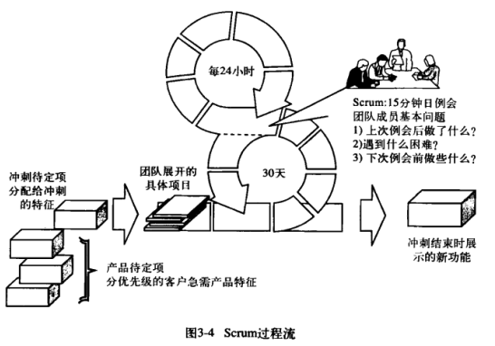

# 软件工程概念

> 软件:Instructions+Data structures+descriptive information(Document)

**软件工程定义:**

1. 将**系统化Systematic** **规范化disciplined** **可量化quantifiable** 的方法用于软件的开发 运行和维护  将工程化方法用于软件
2. 对上条所述方法的研究

**Reasons of evolving legacy system**

- Software must be ==adapted== to meet the needs of new computing environments or technology. 
- Software must be ==enhanced== to implement new business requirements.
- Software must be ==extended== to make it interoperable with other more modern systems or databases.
- Software must be ==re-architected== to make it viable within a network environment.

**软件工程层次**

1. 工具
2. 方法
3. 过程 process **基础**
4. 质量关注点 quality focus **根基**

## 软件过程

> ==软件过程==:A process is a collection of **activities**, **actions**, and **tasks** that are performed when some work product is to be created.
>
> 工作产品构建时所执行的一系列 **活动 动作和任务**

**umbrella activities 普适性活动**

- 沟通 communication
- 策划 planning
- 建模 modeling
- 构建 construction
- 部署 deployment

### 过程模型

#### 过程流

>   **过程流(Process Flow)** : 描述了在执行顺序和时间上，框架中活动动作和任务的组织

| 过程流            | 描述                                         |
| ----------------- | -------------------------------------------- |
| 线性 linear       | 顺序执行5个活动                              |
| 迭代 iterative    | 执行下一个活动前重复执行之前的一个或多个活动 |
| 演化 evolutionary | 采用循环的方式执行各个活动 每次循环更完善    |
| 并行 parallel     | 多活动并行                                   |

>   过程模型:针对问题的解决方案

#### 瀑布模型

>   waterfall model/classic life cycle

一个系统的顺序的软件开发模式

>   V-model 瀑布模型的变体

V模型提供了一种将验证确定动作应用于早期软件工程工作的方法

#### 增量模型

>   Incremental PM

~~类似于流水线的瀑布模型~~

#### 演化模型

>   Evolutionary PM

迭代的过程模型

两种常用的演化过程模型

-   [原型开发](#Prototyping) ：对效率、兼容性和交互形式等情况不清楚
-   [螺旋模型](#Spiral) ：开发大型系统和软件

##### Prototyping

用于快速产生可执行程序

##### Spiral

结合了原型的迭代性质和瀑布模型的系统性和可控性

两大特点

-   采用循环的方式逐步加深系统定义和实现的深度，同时降低风险
-   确定一系列里程碑，确保利益相关者(**stakeholders**)都支持可行的和令人满意的系统解决方案

#### 协同模式

>   Concurrent development model

允许表述任何模型的迭代和并发元素

协同模型中建模活动的软件工程活动的一种表述

#### 专用过程模型

##### 基于构件的开发

生产构件

本质上是演化模型，以迭代方式构建软件

##### 形式化

生成计算机软件形式化的数学规格说明

##### 面向方面的软件开发

特别的关注点被称为切面(**aspects**)

也称为 面向切面编程(Aspect-Oriented Programming, AOP)

#### 统一过程

>   Unified Process
>
>   用例驱动 以架构为核心 迭代且增量

UML 统一建模语言 变成面向对象软件开发的实际标准

统一过程的阶段

-   起始阶段(inception)
-   细化阶段(elaboration)
-   构建阶段(construction)
-   转换阶段(transition)
-   生产阶段(production)

### 敏捷开发 agile process

> agile manifesto
>
> - 个体和交互胜过过程和工具
> - 可工作软件胜过宽泛的文档
> - 用户合作胜过合同谈判
> - 响应变化胜过遵循计划

敏捷开发的目的:为了克服传统软件工程中认识和实践的弱点而形成的

**敏捷原则**

1. 尽早交付产品，且持续交付有价值的软件产品(incremental)
2. 欢迎需求更改(需求更改适应性很强)，利用变化为用户提供竞争优势
3. 持续交付产品，交付周期很短
4. 业务人员和开发人员必须在整个项目中每天一起工作
5. 向开发团队传递信息的最有效的方法是==面对面的交谈==
6. 交给有动力的人开发，给他们提供环境，并相信他们
7. 可工作的软件是进度的主要度量
8. 过程可持续发展
9. 对技术卓越和良好设计的持续关注可以增强敏捷性
10. 简单:将未完成的工作量最大化的艺术
11. 架构，需求和设计来自组织团队
12. 团队定期反思如何变得更有效率，然后应地调整和调整其行为

#### XP

>   eXtreme Programming, XP

要素

-   沟通
-   简明(Keep it simple)
-   反馈
-   鼓励
-   尊重

>   只对即时需求做设计，设计需要改进则重构

XP framework activities

- planning
  - 了解需求
  - 预计成本
  - 分组
  - 交付
  - 以第一个增量定义速度
- design
  - KIS(keep it simple)
  - CRC(class-responsibility-collaborator 类-职责-协作者) Cards
  - 困难->Spike
- coding
  - 开始前建立unit test
  - 鼓励结对编程
- testing
  - 当天单元测试
  - 验收测试由客户定义并执行

> **Spike** ：如果在某个故事设计中碰到困难，立即建立这部分设计的可执行原型，实现并评估设计原型

#### Scrum

过程由“需求、分析、设计、演化和交付”等框架性活动组成

每一个框架活动中，发生于一个过程模式中的工作任务称为一个冲刺(sprint)

| 待定项 | backlog | 优先级列表             |
| ------ | ------- | ---------------------- |
| 冲刺   | sprint  | 预定的短期不可变更任务 |

## 建模

### 需求工程

> **需求工程(requirement engineering RE)**:致力于不断理解需求的大量任务和技术(开始于沟通并持续到建模活动)

7大核心步骤

- 起始(Inception) ask a set of questions that establish basic understanding. 
  - identifying stakeholder 确认利益相关者
  - recognizing multiple viewpoints 识别多重观点
  - working toward collaboration 协同合作
  - 首次提问
- 导出(Elicitation) elicit requirements from all stakeholders
  - collaborative requirements  gathering 协作收集需求
  - quality function  deployment QFD 质量功能部署
    - normal requirements
    - expected
    - exciting
  - usage scenarios 使用场景
  - elicitation work products 获取工作产品
- 细化(Elaboration) develop a refined requirement model that identifies various aspects of software function, behavior, and information.  用户如何与系统交互
- 协商(negotiation) reconcile conflicts.
- 规格说明(specification) describe the requirements formally or informally.
- 确认(Validation) assess work products of requirement engineering for quality. **需求一致性**
- 需求管理(Management) help the project team identify, control, and track requirements and changes to requirements.

### 建模方法

- 基于场景 scenarios-based models
  - 用户视角
  - 活动图
- 基于类 class-oriented models
  - OOP
  - 类图
- 基于行为 behavioral models
  - 状态图
  - 状态时任何可以观察到的行为模式
- data models
- flow-oriented models

model必须实现三个主要目标

1. 能够描述客户的需求
2. 为软件设计的创建奠定基础
3. 定义一组需求，这些需求可以在软件构建后进行验证

#### scenarios-based

使用 用例图 泳道图 活动图进行从场景创建

需求分析

- 分析的经验规则 rules of thumb
- 域分析:识别 分析 详细说明共同需求
- 需求建模的方法
  - 结构化分析
  - 面向对象分析

#### class-based

1. 识别分析类 identify analysis classes
2. 描述属性 specifying attributes **属性定义了类**
3. 定义操作 defining operations **操作定义对象的行为**
4. 类-职责-协作者建模 CRC **识别和组织与系统或产品需求相关的类**
   1. 职责:和类相关的操作
   2. 协作者:提供完成某个职责所需信息的类

<table border="1">
    <tr>
      <td colspan="2">类:类名</td>
    </tr>
    <tr>
      <td colspan="2">类说明</td>
    </tr>
    <tr>
      <td>职责</td>
      <td>协作者</td>
    </tr>
    <tr>
      <td>显示摄像机位置</td>
      <td>Camera</td>
    </tr>
    <tr>
      <td>...</td>
      <td>...</td>
    </tr>
</table>

CRC索引卡

类间关系(耦合递增顺序)

| 关系 |                | 简介                                    | UML表示          |
| ---- | -------------- | --------------------------------------- | ---------------- |
| 依赖 | dependency     | 作为参数使用之类                        | 箭头虚线         |
| 关联 | association    | 对象引用关系 有方向性                   | 实现(带箭头)     |
| 聚合 | aggregation    | 特殊的关联 **语义上表示集体与个体关联** | 空心菱形的实线   |
| 组合 | composition    | 特殊的关联 **个体和部分之间的关联**     | 实心菱形的实线   |
| 实现 | realization    | 实现接口                                | 空心三角箭头虚线 |
| 泛化 | generalization | 继承                                    | 空心三角箭头实线 |

简化

- 依赖 use a
- 关联 has/contains a
- 实现
- 泛化 is a

#### behavioral model

> 最基础元素是用例 use-case

使用类图和时序图

**描述了软件如何响应外部事件和刺激**:

1. 评估所有用例，以充分理解系统中的交互顺序
2. 找出驱动交互的事件和这些事件和哪些特定对象相关
3. 创建sequence for use case
4. 为系统创建状态图
5. 重新评测行为模型以检验正确性和一致性

**考虑两种不同的状态描述**:

1. 每个类在系统执行其功能时的状态
2. 当系统执行其功能时，从外部观察到的系统状态

#### [UML](https://www.visual-paradigm.com/cn/guide/uml-unified-modeling-language/what-is-uml/)

##### [类图](https://zhuanlan.zhihu.com/p/109655171)

抽象类 类名斜体

##### [use-case](https://www.w3cschool.cn/uml_tutorial/uml_tutorial-z58d28xs.html)

注意 extend 和 include

include 指向公共依赖用例 ~~包含关系~~

extend 对指向用例的细化和拓展

##### [activities](https://www.w3cschool.cn/uml_tutorial/uml_tutorial-ncjp28y6.html)

结点为 action/activity

##### [states](https://www.w3cschool.cn/uml_tutorial/uml_tutorial-jnf328y2.html)

结点为状态 边为条件

### 设计概念

> 良好设计的三个特征
>
> - 实现需求模型的**明确需求**和stakeholder期望的**隐含需求**
> - 对于coder之类 设计必须是==可读的 可理解的==指南
> - 设计必须==提供软件的全貌== 从实现角度说明数据域、功能域和行为域

良好设计的类的四个特征

- 完整性与充分性
- 原始性
- 高内聚性
- 低耦合性

| 设计模型的类型 | 简介                                                   | 用途                         |
| -------------- | ------------------------------------------------------ | ---------------------------- |
| 数据/类        | 将类模型转换为设计类的实现及软件实现所需要的数据结构   |                              |
| 体系结构       | 定义了软件的主要构造元素之间的关系.                    | 可用于系统约束和需求模型导出 |
| 接口           | 软件和系统 软件和使用人员间通信方式                    | 行为模型为该设计提供大量信息 |
| 构件级         | 将软件体系结构的结构化元素变换为对软件构件的过程性描述 |                              |

#### [内聚与耦合](https://www.geeksforgeeks.org/software-engineering-coupling-and-cohesion/)

- cohesion
  - 模块相关功能的强度
  - 内聚的模块执行单个任务
  - 一个内聚的模块只做一件事(理想情况)

- coupling
  - 类之间彼此联系程度的度量
  - 模块间相互连接
  - 依赖于接口复杂性 引用或进入模块所在的点以及数据通过接口进行的传递
  - 尽力做到低耦合

耦合类型与高低

内聚类型与强弱

> 内聚表明功能单一 使得系统易于实现、维护和测试

#### design model

- 数据设计元素
- 体系结构设计元素:提供软件的整体视图
- 接口设计元素:信息流动和构建通信
  - UI接口
  - 内部接口
  - 外部接口
- 构件级设计元素:每个软件构件的内部细节
- 部署级设计元素:指明软件功能和子系统将如何在支持软件的物理计算环境内进行分布

观察设计模型的维度

- 过程维度:设计模型的演化
- 抽象维度:详细设计

#### design principles

| design principle | SOLID                           |              | 描述                             |
| ---------------- | ------------------------------- | ------------ | -------------------------------- |
| SRP              | Single Reposibility Principle   | 单一职责原则 | 一个类应该只有一个发生变化的原因 |
| OCP              | Open Closed Principle           | 开闭原则     | 对拓展开放 对修改封闭            |
| LSP              | Liskov Substitution Principle   | 里氏替换原则 | 子类替换基类                     |
| ISP              | Interface Segregation Principle | 接口分离原则 | 多客户专用接口比单一通用接口好   |
| DIP              | Dependency Inversion Principle  | 依赖倒置原则 | 依赖于抽象而非具体实现           |

### 体系结构设计

> 体系结构设计表示建立计算机系统所需的数据结构和程序构件

#### 定义

> 程序或计算系统的==软件体系结构==是指系统的一个或多个结构，它包括软件构件、构件的外部可见属性以及他们之间的相互关系

体系结构是一种表示  使软件工程师能够:

1. 分析设计在满足规定要求方面的有效性
2. 在设计变更相对容易的阶段考虑建筑替代方案
3. 降低与软件构建相关的风险

#### 风格

每个体系结构风格都描述了一种系统类别

- 一组执行系统所需功能的构件
- 一组实现构件间通信合作和协调的连接件
- 定义构件如何集成为系统的约束
- 能够使设计者通过分析系统组成元素的已知属性来理解系统整体性质的语义模型

简单分类

-   以数据为中心的体系结构:促进可集成性(Integrability)
-   数据流体系结构:pipe/filter
-   调用和返回体系结构:controller/sub-apps
-   面向过程调用体系结构
-   面向对象体系结构
-   层次体系结构

以数据为中心

数据流

### 构件级设计

#### 定义

| 观点         | 定义                   | 补充                                              |
| ------------ | ---------------------- | ------------------------------------------------- |
| OO           | 包含一个协作类集合     | 必须定义接口                                      |
| 传统观点     | 程序的一个功能要素     | 也成为模块                                        |
| 过程相关观点 | 用于组装体系结构的部分 | 使用已经验证的设计或者代码构建目录 从目录选取构建 |

### UI设计

#### Golden Rules(3)

1. ==把控制权交给用户==(place the user in control):提供灵活的交互 允许撤销终止操作
2. ==减轻用户的记忆负担==(reduce the user's memory load):定义直观的快捷方式 减轻短期记忆要求 建立有意义的默认设置
3. ==保持界面一致==(make the interface consistent):在完整产品线内保持一致性 允许用户将当前任务放入有意义的环境中

#### UI分析与设计模型

| 模型              |                                | 介绍                                     |
| ----------------- | ------------------------------ | ---------------------------------------- |
| 用户模型          | user model                     | 工程师建立 确定系统所有最终用户轮廓  |
| 设计模型          | design model                   | 软件工程师创建                           |
| 心理模型/系统感觉 | mental model/system perception | 最终用户脑海对界面的想象                 |
| 实现模型          |                                | 组合外在表现和描述系统语法语义的支撑信息 |

**UI迭代设计**:

- 界面分析和建模 interface annalysis and modeling
- 界面设计 interface design
- 界面构建 interface construction
- 界面确认 interface validation

## 质量管理

测试目的:证明软件有错

### 传统测试策略

测试策略阶段:

| 测试阶段             |             | 重点                        |                    |
| -------------------- | ----------- | --------------------------- | ------------------ |
| 单元                 | unit        | 源代码形式实现的每个单元    | code               |
| 集成                 | integration | 软件体系结构的设计和构建    | design             |
| 回归(集成测试的部分) | regression  | 保证新逻辑/IO不影响功能     | design             |
| 确认                 | validation  | 确认满足功能 行为和性能需求 | requirement        |
| 系统                 | system      | 验证系统功能和性能达标      | system engineering |

> ==验证(verification)== 确保软件正确地实现某一功能的一系列活动

> ==确认(validation)== 确保开发的软件可以追溯到客户需求的另外一系列活动

#### 集成测试

自顶向下集成(依赖桩)

- 主控模块(主程序)开始 替换所有模块为桩模块
- DFS/BFS 用实际模块替换桩模块
- 替换一个后就测试
- 执行回归测试确保没有引入新错误

自底向上(从最底层原子模块开始) **不依赖桩**

- 链接底层构件以完成特定子功能的簇
- 编写驱动模块以协调测试用例的输入和输出
- 测试簇
- 去掉驱动程序 沿着程序结构向上逐步链接簇

### OO测试

> 最小可测试单元为类的操作

| 测试阶段 | 重点                                        | 与传统对比               |
| -------- | ------------------------------------------- | ------------------------ |
| 类       | 类的操作                                    | 侧重于操作和类的状态行为 |
| 集成     | 基于线程/使用的测试                         | 没有明显分层控制结构     |
| 簇       | 设计测试用例测试一组协作类 发现协作中的错误 |                          |

不同环境的单元测试的侧重点对比

| OO                               | Conventional                 |
| -------------------------------- | ---------------------------- |
| 封装在该类中的操作和类的状态行为 | 模块的算法细节和模块接口数据 |

OO集成测试

- 基于线程的测试:集成了一组响应系统输入或事件的类
- 基于使用的测试:通过测试独立的类开始系统的构建

### 确认测试

> 简单定义:按客户合理预期方式工作就算成功

| 测试     | 测试环境     | 测试者        | 应用环境   | 错误记录         |
| -------- | ------------ | ------------- | ---------- | ---------------- |
| $\alpha$ | 开发者场所   | 最终用户      | 受控环境   | 开发者记录       |
| $\beta$  | 最终用户场所 | 最终用户/客户 | 不可控环境 | 定期报告给开发者 |

$\beta$测试的一种变体为 客户验收测试  customer  acceptance  testing

### 系统测试

| 测试类型 |             | 方式                                                       |
| -------- | ----------- | ---------------------------------------------------------- |
| 恢复测试 | recovery    | 通过各种方式强制地让系统发生故障，并验收其能适当恢复       |
| 安全测试 | security    | 验证建立在系统内的保护机制是否能够实际保护系统不受非法入侵 |
| 压力测试 | stress      | 以一种非正常的数量、频率或容量的方式执行系统               |
| 性能测试 | performance | 用于测试软件在集成环境中的运行性能                         |
| 部署测试 | deployment  | 在软件将要运行的每一种环境中测试软件                       |

### 测试传统的应用系统

>   测试的目标是发现错误

可测试软件的特性

-   可测试性：程序能够被测试的容易程度
-   可操作性：运行得越好，越能有效地测试
-   可观察性：作为测试的一部分所提供的输入会产生清楚的输出
-   可控制性
-   可分解行
-   简单性
-   稳定性
-   易理解性

好的测试的属性

- 有较高发现错误的可能性 high probability of finding an error
- 不冗余 not redundant
- 最佳品种:在一组具有相似目的的测试中，应该使用最有可能发现所有类别错误的测试 best of
  breed
- 既不会太简单也不会太复杂 be neither too simple nor too complex

| 测试     | 白盒测试               | 黑盒测试           |
| -------- | ---------------------- | ------------------ |
| 测试重点 | 基于过程细节的封闭检查 | 软件接口处执行测试 |
| 检查内容 | 检查条件集和循环       | 检查系统的功能     |
| 别名     | 结构检测               | 功能检测           |
| 时期     | 早期(内部)             | 后期(外部)         |

#### 白盒测试

##### 基本路径测试

计算过程设计的逻辑复杂性测量(logical complexity measure) 并以这种测量来指导定义执行路径的基本集(保证程序中每条语句至少执行一次)

##### 流图/程序图

流图(flow graph)和流程图(flow chart)切换

>   **独立路径**:任何贯穿程序的、至少引入一组新处理语句或一个新条件的路径

按照流图描述:独立路径必须沿着至少一条定义该路径前未被遍历的边移动

上图b独立路径

-   1-11
-   1-2-3-4-5-10-1-11
-   1-2-3-6-7-9-10-1-11
-   1-2-3-6-8-9-10-1-11

>   ==环复杂度(cyclomatic complexity)==的值定义了程序基本集合中的独立路径数
>
>   提供了所需测试数量的==**上限**==

多种计算方法

1.   流图中域的数量与环复杂性相对应。
2.   对于流图G,环复杂性V(G)定义如下: $V(G)= E-N+2$
     其中E为流图的边数，N为流图的结点数。
3.   对于流图G,环复杂性V(G)也可以定义如下: $V(G) =P+ 1$
     其中P为包含在流图G中的判定结点数。

再回到上图b中的流图，环复杂性可以通过上述3种算法来计算:

1.   该流图有4个域
2.   V(G) = 11(边数)- 9(结点数)+2=4
3.   V(G) = 3(判定结点数)+ 1=4

因此，图b中流图的环复杂性是4。

##### 导出测试用例

步骤

1.   以设计或源代码为基础，画出相应的流图
2.   确定所得流图的环复杂度
3.   确定线性独立路径的基本集合
4.   准备测试用例

#### 黑盒测试

> 行为测试

试图发现以下错误

- incorrect or missing functions
- interface errors
- errors in data structures or external database access
- behavior or performance errors
- initialization and termination errors.

| 测试方法     |                          | 测试方式                     |
| ------------ | ------------------------ | ---------------------------- |
| 基于图的测试 | graph-based              | 理解和验证对象间的关系       |
| 等价类划分   | equivalence partitioning | 划分输入为多类 生成测试用例  |
| 边界值分析   | boundary value analysis  | 在输入输出域边界导出测试用例 |

## 概念

| 概念               | concept                 | 定义                                                         |
| ------------------ | ----------------------- | ------------------------------------------------------------ |
| 软件               |                         | Instructions+Data structures+descriptive information(Document) |
| 软件工程           |                         | 将系统化Systematic 规范化disciplined 可量化quantifiable 的方法用于软件的开发 运行和维护  将工程化方法用于软件 及方法的研究 |
| 软件过程           | software process        | 工作产品构建时所执行的一系列 **活动 动作和任务**             |
| 过程流             | Process Flow            | 描述了在执行顺序和时间上，框架中活动动作和任务的组织         |
| 过程模型           |                         | 针对问题的解决方案                                           |
| 敏捷的基本动力     |                         | 普遍存在的变化                                               |
| 统一过程           | unified process         | 用例驱动 以架构为核心 迭代且增量                             |
|                    | Spike                   | 如果在某个故事设计中碰到困难，立即建立这部分设计的可执行原型，实现并评估设计原型 |
| 重构               | refactor                | 以不改变代码外部行为而改进其内部结构的方式来修改软件系统的过程 |
| 冲刺               | sprint                  | (Scrum)预定的短期不可变更任务                                |
| 需求工程           | requirement engineering | 致力于不断理解需求的大量任务和技术(开始于沟通并持续到建模活动) |
| 类-职责-协作者建模 | CRC                     |                                                              |
| 内聚               | cohesion                | 模块相关功能的强度                                           |
| 耦合               | coupling                | 类之间彼此联系程度的度量                                     |
| 软件体系结构       |                         | 系统的一个或多个结构，它包括软件构件、构件的外部可见属性以及他们之间的相互关系 |
| 验证               | verification            | 确保软件正确地实现某一功能的一系列活动                       |
| 确认               | validation              | 确保开发的软件可以追溯到客户需求的一系列活动                 |
| 测试的目的         |                         | 发现错误                                                     |
| 独立路径           | independency path       | 任何贯穿程序的、至少引入一组新处理语句或一个新条件的路径     |
| 环复杂度           | cyclomatic complexity   | 定义了程序基本集合中的独立路径数                             |
|                    |                         |                                                              |
|                    |                         |                                                              |
|                    |                         |                                                              |
|                    |                         |                                                              |

### 多点

**Reasons of evolving legacy system**

- Software must be  **adapted**  to meet the needs of new computing environments or technology. 
- Software must be  **enhanced**  to implement new business requirements.
- Software must be  **extended**  to make it interoperable with other more modern systems or databases.
- Software must be  **re-architected**  to make it viable within a network environment.

**软件工程层次**

1. 工具
2. 方法
3. 过程 process **基础**
4. 质量关注点 quality focus **根基**

**umbrella activities 普适性活动**

- 沟通 communication
- 策划 planning
- 建模 modeling
- 构建 construction
- 部署 deployment

**UP阶段**

-   起始阶段(inception)
-   细化阶段(elaboration)
-   构建阶段(construction)
-   转换阶段(transition)
-   生产阶段(production)

**XP要素**

-   沟通
-   简明(Keep it simple)
-   反馈
-   鼓励
-   尊重

**XP框架活动**

- planning
  - 了解需求
  - 预计成本
  - 分组
  - 交付
  - 以第一个增量定义速度
- design
  - KIS(keep it simple)
  - CRC(class-responsibility-collaborator 类-职责-协作者) Cards
  - 困难->Spike
- coding
  - 开始前建立unit test
  - 鼓励结对编程
- testing
  - 当天单元测试
  - 验收测试由客户定义并执行

**需求**

- 用户为解决某一问题或为达到某个目标所需要的条件或者能力
- 系统或者系统部分为满足合同、标准、规格说明或其他正式的强制性文档所必须具有的条件或者能力
- 对上面描述的条件或者能力的文档化说明

**需求工程7大核心步骤**

- 起始(Inception) ask a set of questions that establish basic understanding. 
  - identifying stakeholder 确认利益相关者
  - recognizing multiple viewpoints 识别多重观点
  - working toward collaboration 协同合作
  - 首次提问
- 导出(Elicitation) elicit requirements from all stakeholders
  - collaborative requirements  gathering 协作收集需求
  - quality function  deployment QFD 质量功能部署
    - normal requirements
    - expected
    - exciting
  - usage scenarios 使用场景
  - elicitation work products 获取工作产品
- 细化(Elaboration) develop a refined requirement model that identifies various aspects of software function, behavior, and information.  用户如何与系统交互
- 协商(negotiation) reconcile conflicts.
- 规格说明(specification) describe the requirements formally or informally.
- 确认(Validation) assess work products of requirement engineering for quality. **需求一致性**
- 需求管理(Management) help the project team identify, control, and track requirements and changes to requirements.

**model必须实现三个主要目标**

1. 能够描述客户的需求
2. 为软件设计的创建奠定基础
3. 定义一组需求，这些需求可以在软件构建后进行验证

**良好设计的三个特征**

- 实现需求模型的**明确需求**和stakeholder期望的**隐含需求**
- 对于coder之类 设计必须是==可读的 可理解的==指南
- 设计必须==提供软件的全貌== 从实现角度说明数据域、功能域和行为域

**良好设计的类的四个特征**

- 完整性与充分性
- 原始性
- 高内聚性
- 低耦合性

**体系结构作用**

1. 分析设计在满足规定要求方面的有效性
2. 在设计变更相对容易的阶段考虑建筑替代方案
3. 降低与软件构建相关的风险

**体系结构风格都描述了一种系统类别**

- 一组执行系统所需功能的构件
- 一组实现构件间通信合作和协调的连接件
- 定义构件如何集成为系统的约束
- 能够使设计者通过分析系统组成元素的已知属性来理解系统整体性质的语义模型

**Golden Rules(3)**

1. ==把控制权交给用户==(place the user in control):提供灵活的交互 允许撤销终止操作
2. ==减轻用户的记忆负担==(reduce the user's memory load):定义直观的快捷方式 减轻短期记忆要求 建立有意义的默认设置
3. ==保持界面一致==(make the interface consistent):在完整产品线内保持一致性 允许用户将当前任务放入有意义的环境中

