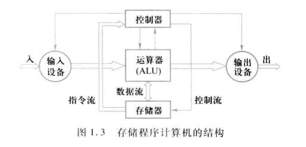
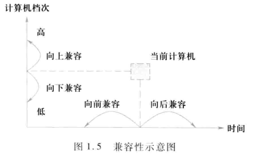

# 计算机体系结构

## 概念

计算机系统的层次结构

> 某层的语言就是该层计算机的机器语言

|      | 计算机               | 机器语言                        | 使用者               | 实现                                |
| ---- | -------------------- | ------------------------------- | -------------------- | ----------------------------------- |
| L6   | 应用语言虚拟机       |                                 |                      | 由应用程序翻译到L5                  |
| L5   | 高级语言虚拟机       | 高级语言                        |                      | 编译器翻译到L4/L3级语言或者直接解释 |
| L4   | 汇编语言虚拟机       | 汇编语言                        |                      | 汇编程序翻译为L3/L2语言             |
| L3   | 操作系统虚拟机       | 传统的机器指令集+操作系统级指令 |                      | L3(OS级指令)/L2共同解释执行         |
| L2   | 机器语言(传统机器级) | 传统的机器指令集                |                      | L1级微程序解释(仿真emulation)       |
| L1   | 微程序机器级         | 微指令集                        | 计算机硬件的设计人员 | 由固件/硬件解释(不一定有这一级)     |

翻译(translation):将上级全部变为下级后再执行

解释(interpretation):每次处理一条语句后执行

### 系统结构的定义

> 计算机系统结构是程序员所看到的计算机属性:概念性结构与功能特性

广义的系统结构:计算机设计的三个方面

- 指令集结构
- 组成
- 硬件

> 计算机系统结构概念的实际是确定计算机系统中**软硬件**的界面/分界

> 在Amdahl的传统定义中 系统结构所包含的属性是指机器语言程序设计员(或者编译程序代码生成系统)为使其设计(或生成)的程序能在计算机上正确运行所需遵循的计算机属性

对于通用寄存器型计算机来说,这些属性主要是指:
- 指令系统(包括机器指令的操作类型和格式指令间的排序和控制机构等)
- 数据表示(硬件能直接识别和处理的数据类型)
- 寻址规则(包括最小寻址单元、寻址方式及其表示)
- 寄存器定义(包括各种寄存器的定义、数量和使用方式)
- 中断系统(中断的类型和中断响应硬件的功能等)
- 机器工作状态的定义和切换(如管态和目态等)
- 存储系统(主存容量、程序员可用的最大存储容量等)
- 信息保护(包括信息保护方式和硬件对信息保护的支持)
- I/O结构(包括I/O连接方式处理机/存储器与I/O设备间数据传送的方式和格式以及I/O操作的状态等)

| 概念           | 定义                     | 着眼点                                                       |
| -------------- | ------------------------ | ------------------------------------------------------------ |
| 计算机系统结构 | 传统机器级所具有的属性   | 软硬件界面                                                   |
| 计算机组成     | 计算机系统结构的逻辑实现 | 物理机器级内各事件的排序方式与控制方式 各部件的功能以及各部件之间的联系 |
| 计算机实现     | 计算机组成的物理实现     | 器件技术和微组装技术                                         |

### 分类

| 分类法 | 分类依据                           |
| ------ | ---------------------------------- |
| 冯氏法 | 用系统的最大并行度分类             |
| Flynn  | 按照指令流和数据流的多倍性进行分类 |

> 最大并行度: 计算机系统在单位时间内能够处理的最大的二进制位数 $m\text{(字数)}\,{\rm x}\,n\text{(字宽)}$

Flynn定义

| 指令流               | 数据流               | 多倍性                                    |
| -------------------- | -------------------- | ----------------------------------------- |
| instruction stream   | data stream          | multiplicity                              |
| 计算机执行的指令序列 | 指令流调用的数据序列 | 同时处于统一执行阶段的指令/数据的最大数目 |

- SISD 是传统的顺序处理计算机

- SIMD以阵列处理机为代表
- MISD没有实际应用
- MIMD包含多处理机结构

### 定量原理

1. 以经常性事件为重点
2. Amdahl定律
3. CPU性能公式
4. 程序局部性原理(代码/数据访问的时间/空间局部性)

> Amdahl定理定义加速比

$$
系统加速比=\frac {总执行时间_{改进前}}{总执行时间_{改进后}}=\frac 1 {(1-可改进比例)+\frac{可改进比例}{部件加速比}}
$$

$$
CPU时间=时钟周期数\times时钟周期时间=IC\times CPI\times时钟周期时间
$$

| 参数             | 含义                                       | 影响因素                 |
| ---------------- | ------------------------------------------ | ------------------------ |
| **时钟周期时间** | **系统频率**的倒数                         | 硬件实现技术和计算机组成 |
| IC               | instruction count                          | 计算机组成和指令集结构   |
| CPI              | Cycle Per Instruction 指令的平均时钟周期数 | 指令集结构和编译技术     |

$$
CPU时钟周期数=\sum_{i=1}^n(CPI_i\times IC_i)
$$

$$
CPI=\frac{时钟周期数}{IC}=\sum_{i=1}^n(CPI_i\times \frac{IC_i}{IC})
$$

### 性能评测

> 性能比为执行时间的反比

性能评价方式:**使用真实的程序的执行时间来衡量**

两种执行时间

- 总/平均执行时间
- 加权执行时间

$$
S=\frac 1 n\sum_{i=1}^nT_i
$$

$$
A=\sum_{i=1}^nW_i\cdot T_i
$$

### 结构

#### 冯诺依曼结构

冯氏机由

- 运算器(ALU)
- 控制器
- 存储器
- 输入设备
- 输出设备

构成

特点

- 运算器为中心
- 指令和数据一样对待
- 存储器按地址访问
- 顺序执行
- 指令由操作码和地址码组成
- 指令和数据都是二进制

#### IO改进

把IO管理从CPU分离下放

- 程序控制(CPU为中心)
  - 程序等待
  - 程序中断
- DMA(外设与存储器建立数据通路)
  - 成组传递
  - 周期挪用
- I/O处理机
  - 通道
  - 外围处理机

#### 并行处理技术

- 微操作级
- 指令级
- 线程级
- 任务级

#### 存储器组织结构

设置通用寄存器组

在CPU和Memory中设置Cache

#### 指令集发展

- CISC
- RISC
- (Hybrid)

#### 可移植性

- 系列机
- 模拟与仿真
- 统一高级语言

系列机的四种软件兼容(**向后兼容**是必要的)

|                  | 含义                         | 实现方式   | 存储位置   |
| ---------------- | ---------------------------- | ---------- | ---------- |
| 模拟(simulation) | 用软件方式实现另一种指令集   | 纯软件解释 | 主存       |
| 仿真(emulation)  | 用微程序解释实现另一种指令集 | 仿真微程序 | 控制存储器 |

### 并行性

并行性(parallelism)指计算机系统在同一时刻或同一时间间隔内进行多种运算或操作(时间上重叠)

- 同时性(simultaneity) 同一时刻
- 并发性(concurrency) 同一时段

| 处理数据的并行等级 | 处理数据               | 并行能力 |
| ------------------ | ---------------------- | -------- |
| 字串位串           | 每次处理一个字的一位   | 无       |
| 字串位并           | 同时处理一个字的全部位 | 开始并行 |
| 字并位串           | 同时处理多字的同一位   | 较高并行 |
| 字并位并           | 同时处理多字的多位     | 最高并行 |

执行程序的并行性等级

- 指令内部并行
- 指令级并行
- 线程级并行
- 任务级或进程级并行
- 作业或程序级并行

> 当并行性提高到一定级别时 称之进入并行处理(parallel processing)领域

 提高并行性技术途径

- 时间重叠(time interleaving) 引入时间因素 让多处理过程在时间上错开
- 资源重复(resource replication) 引入空间因素 增加硬件资源提高性能
- 资源共享(resource sharing) 软件方式

## 指令集结构

### 分类

> 区别不同指令集结构的主要因素:**CPU中用来存储操作数的存储单元的类型**(堆栈/累加器/通用寄存器组)

通用寄存器结构可以根据操作数来源分为

- 寄存器-存储器(RM)结构
- 寄存器-寄存器(RR)结构(load/store结构)
- ~~存储器-存储器(MM)结构~~

不同结构的操作数

| 结构   | 操作数                                                    | 结果         |
| ------ | --------------------------------------------------------- | ------------ |
| 堆栈   | 隐式操作数(ToS和次栈顶)                                   | ToS          |
| 累加器 | 一个操作数是隐式的(累加器) 另一个操作数是显式的存储器单元 | 送回累加器   |
| RM/RR  | 显式给出                                                  | 通用寄存器组 |

### 寻址方式

> 指一种指令集结构如何确定所要访问的数据的地址

对于存储器而言 由寻址方式确定的实际存储器地址称为有效地址(effective address)

| 寻址方式       | 指令实例            | 含义                               |
| -------------- | ------------------- | ---------------------------------- |
| 寄存器寻址     | `ADD R1, R2`        | `Regs[R1]<-Regs[R1]+Regs[R2]`               |
| 立即数寻址     | `ADD R3, #6`        | `Regs[R3]<-Regs[R3]+6`                   |
| 偏移寻址       | `ADD R3, 120(R2)`   | `Regs[R3]<-Regs[R3]+Mem[120+Regs[R2]]`        |
| 寄存器间接寻址 | `ADD R3,(R2)`       | `Regs[R3]<-Regs[R3]+Mem[Regs[2]]`             |
| 索引寻址       | `ADD R3, (R1+R2)`   | `Regs[R3]<-Regs[R4]+Mem[Regs[R1]+Regs[R2]]`      |
| 直接/绝对寻址  | `ADD R1, (1010)`    | `Regs[R1]<-Regs[R1]+Mem[1010]`             |
| 存储器间接寻址 | `ADD R2,@(R1)`      | `Regs[R2]<-Regs[R2]+Mem[Mem[R1]]`            |
| 自增寻址       | `ADD R1,(R2)+`      | `Regs[R1]<-Regs[R1]+Mem[Regs[R2]]` `Regs[R2]<-Regs[R2]+d` |
| 自减寻址       | `ADD R1,-(R2)`      | `Regs[R2]<-Regs[R2]-d` `Regs[R1]<-Regs[R1]+Mem[Regs[R2]]` |
| 缩放寻址       | `ADD R1,80(R2)[R3]` | `Regs[R1]<-Regs[R1]+Mem[80+Regs[R2]+Regs[R3]*d]` |

### 功能设计

> 功能设计:确定软硬件功能分配

硬件实现的考虑因素

- 速度
- 成本
- 灵活性

对指令集的基本要求

- 完整性: 在优先的存储空间 对于可解的问题 指令集提供的指令足够使用
- 规整性(一般只实现有限的规整性)
  - 对称性:存储单元的使用和操作码的设置等都是对称的
  - 均匀性:对于各种不同的操作数类型/字长/操作种类和数据存储单元都要同等对待
  
- 高效率:指令的执行速度快 使用频率高
- 兼容性

#### CISC的功能设计

1. 面向目标程序增强指令功能(提高性能最直接办法)**硬件加速高频率**/**新指令替代高频指令串**
   1. 增强运算型指令的功能
   2. 增强数据传送指令的功能
   3. 增强程序控制指令的功能
2. 面向高级语言的优化实现来改进指令集
   1. 增强对高级语言和编译器的支持(面向高级语言的计算机)
   2. 高级语言计算机(减少翻译 提高解释比重)~~比较激进 前OS时代~~
3. 面向操作系统的优化实现改进指令集
   1. 指令集对操作系统的主要支持(包含特权指令)
      1. 处理机工作状态和访问方式的切换
      2. 进程的管理和切换
      3. 存储管理和信息保护
      4. 进程的同步与互斥
      5. 信号灯的管理
      6. ...



CISC的问题

1. 大量简单指令高频使用
2. 控制器硬件复杂 设计困难且容易出错
3. 平均指令CPI较大 困难增加整个程序的执行时间
4. 规整性不好 不利于采用流水技术提高性能

#### RISC的功能设计

RISC的一般原则

- 指令条数少而简单(只选取高频和最有用指令)
- 采用简单且统一的指令格式 并减少寻址方式(字长32/64bit)
- 指令执行在单周期完成(流水线机制下)
- 采用load-store结构
- 大多数指令采用硬件逻辑实现
- 强调优化编译器作用
- 充分利用流水技术

#### 控制指令

改变控制流的4中指令

- **条件分支(conditional branch)**~~最高频~~
- 跳转(jump)
- 过程调用(call)
- 过程返回(return)

常用的3种分支

| 名称                           | 检测方法                             | 优点                   | 缺点                        |
| ------------------------------ | ------------------------------------ | ---------------------- | --------------------------- |
| 条件码(condition code, CC)     | ALU操作设置的特殊的位                | 自由设置分支条件       | 增设状态                    |
| 条件寄存器                     | 比较指令把计较结果放入寄存器         | 简单                   | 占用寄存器                  |
| 比较与分支(compare and branch) | 比较操作是分支指令的一部分(受限比较) | 用一条指令就能实现分支 | 流水时 可能无法在一拍能完成 |

> PC相对寻址: 在指令中提供一个(基于PC的)偏移量 目标地址由偏移算出~~可实现**位置无关**~~

### 操作数的类型和大小

|                               | 界面                            | 实例                      |
| ----------------------------- | ------------------------------- | ------------------------- |
| 数据表示(data representation) | 硬件直接识别 指令集可以直接调用 | 整数 布尔值 浮点数 字符串 |
| 数据结构(data structure)      | 软件处理和实现                  |                           |

表示操作数类型的两种方法

- 由指令中的操作码指定操作数的类型(常用)
- 给数据加上类型标识

### 指令格式设计

> 确定指令字的编码方式(包括操作码字段的编码和表示方式)

指令:操作码+地址码

寻址方式的两种表示方式

- 与操作码一起编码
- 设置专门的地址描述符(每个操作数由描述符指明寻址方式)

### MIPS64

#### 寄存器

- 32个64位通用寄存器(General-Purpose Registers, GPR) ~~R0-R31~~

- 32个64位浮点寄存器(Floating-Point Registers, FPR) ~~F0-F31~~

> `R0=0` FPR也可以存储单精度浮点数和双精度浮点数

还有一些特殊寄存器

#### 数据表示

- 整数
  - 字节
  - 半字(16)
  - 字(32)
  - 双字(64)
- 浮点数
  - float
  - double

> MIPS操作针对64位整数以及32/64位浮点数
>
> **整数位数不足会零/符号拓展**

#### 数据寻址方式

- 立即数寻址
- 偏移量寻址

寻址字段都是16位 按字节寻址(地址64位)

| 拓展的寻址方式 | 实现               |
| -------------- | ------------------ |
| 寄存器间接寻址 | 把0作为偏移量      |
| 16位绝对寻址   | 把R0作为基址寄存器 |

> load-store结构 所有存储器访问必须是**边界对齐**的

#### 指令格式

MIPS的寻址方式是编码到操作码中

所有的指令都是32位的 操作码6位

| 指令类型\位数 | 6      | 5                | 5    | 5          | 5     | 6     |
| ------------- | ------ | ---------------- | ---- | ---------- | ----- | ----- |
| I             | 操作码 | rs               | rt   | 立即数(16) |       |       |
| R             | 操作码 | rs               | rt   | rd         | shamt | funct |
| J             | 操作码 | 相对PC偏移量(26) |      |            |       |       |

> I类指令
>
> 1. load
> 2. store
> 3. 立即数
> 4. 分支
> 5. 寄存器跳转

> R类指令:ALU指令 专用寄存器读/写指令
>
> `Regs[rd]<-Regs[rs] funct Regs[rt]`

#### MIPS操作

MIPS4类指令

- load/store
- ALU操作
- 分支与跳转
- 浮点操作

## 流水线技术

分解一个重复的过程为多个专门部件实现的子过程 错开各过程的时间

> 流水线的段数称为流水线的深度

用于指令解释执行 -> 指令流水线(取指令 译码 执行 存结果)

用于运算执行过程 -> 运算操作/部件流水线(求阶差 对阶 尾数相加 规格化)

> 流水线的工作过程常采用时空图的方式来描述

流水技术特点

- 分解多个子过程
- 流水线各段时间尽可能相等
- 流水线每个功能部件都要有缓冲寄存器(锁存器) -> 流水寄存器
- 适合与大量重复的时序过程
- 需要有通过时间(第一个任务完成)和排空时间(最后一个任务完成)

### 流水分类

| 功能分类     | 含义                         |
| ------------ | ---------------------------- |
| 单功能流水线 | 只能完成一种固定功能的流水线 |
| 多功能流水线 | 流水线各段可以进行不同的连接 |

| 多功能流水线分类 | 在同一时间内 多功能流水线中的各段的连接方式 |
| ---------------- | ------------------------------------------- |
| **静态流水线**   | 只能按同一种功能的连接方式工作              |
| 动态流水线       | 可以按照不同的方式工作 同时执行多种功能     |

| 流水的级别分类                     |                | 含义                             |
| ---------------------------------- | -------------- | -------------------------------- |
| 部件级流水线                       | 运算操作流水线 | 分段处理机的算数逻辑运算部件     |
| 处理机级流水线                     | 指令流水线     | 流水处理指令的解释执行过程       |
| 处理机间流水线(异构型多处理机系统) | 宏流水线       | 多个处理机串行连接处理同一数据流 |

| 按反馈回路分类 | 含义         | 问题       |
| -------------- | ------------ | ---------- |
| 线性流水线     | 各段串行连接 |            |
| 非线性流水线   | 还有反馈回路 | 争用流水段 |

| 任务流入和流出顺序是否相同分类 | 含义                                 |
| ------------------------------ | ------------------------------------ |
| 顺序流水线                     | 流水线任务流出和流入顺序相同(队列式) |
| 乱序流水线                     | 可以不同                             |

采用流水线的处理机为流水线处理机

| 标量处理机                  | 向量处理机                          |
| --------------------------- | ----------------------------------- |
| scalar pipelining processor | vector pipelining processor         |
| 仅对标量数据流水处理        | 具有向量数据表示和向量指令+流水处理 |

### 流水性能指标

#### 吞吐率

> TP(ThroughPut):单位时间内流水线所完成的任务数量或输出结果数量

$$
TP=\frac n {T_k}
$$

最大吞吐率($TP_{max}=\frac 1 {\Delta t}$)由时间最长的段(**瓶颈段**)决定
$$
TP=\frac n {\sum_{i=1}^k\Delta t_i+(n-1)max(\Delta t_{1..k})}
$$
解决方法

- 细分瓶颈段
- 重复设置瓶颈段

#### 加速比

> ~~流水线的~~加速比(Speedup)为不使用所用时间和使用所用时间之比

$$
S=\frac {T_s} {T_k}
$$

k段流水线完成n个连续任务的实际加速比
$$
S=\frac{n\sum_{i=1}^k\Delta t_i}{\sum_{i=1}^k\Delta t_i+(n-1)max(\Delta t_{1..k})}
$$

#### 效率

> 流水线的效率(Efficiency):流水线的设备实际使用时间与整个运行时间比值(利用率)

$$
E = \frac{n个任务实际占用时空区}{k个段总的时空区}
$$

$$
E=\frac{n\cdot\sum_{i=1}^k\Delta t_i}{k\left[\sum_{i=1}^k\Delta t_i+(n-1)max(\Delta t_{1..k})\right]}=\frac S k
$$

#### 流水线设计的问题

1. 瓶颈问题: 计算机时钟周期取决于瓶颈段的延迟时间
2. 流水线的额外开销: 流水寄存器延迟和时钟偏移开销
   1. 流水寄存器:建立时间/传输延迟
      1. 建立时间:触发写操作的时钟信号到达之前寄存器输入保持稳定的时间
      2. 传输延迟:时钟信号到达后寄存器输出可用的时间
   2. 时钟偏移开销:时钟到达各流水寄存器的最大差值时间
3. 冲突问题

一条指令执行过程

- 取指(IF)
- 译码/读寄存器(ID)
- 执行/有效地址计算(EX)
- 存储器访问/分支完成(MEM)
- 写回(WB)

### 流水相关

> 相关: 两条指令之间存在依赖关系

| 相关类型 | dependence |                                      | 成立条件/类型                                                |
| -------- | ---------- | ------------------------------------ | ------------------------------------------------------------ |
| 数据相关 | data       | 使用的寄存器或者存储器地址           | 后指令使用前指令结果 数据相关的传递                      |
| 名相关   | name       | 寄存器或存储器单元名(可**换名**解决) | **反相关**:指令i读的名和指令j写的名相同 **输出相关**:两指令写相同的名(发生顺序错误) |
| 控制相关 | control    | 分支指令引起                         | 分支控制相关指令不能移到分支前 无分支控制相关指令不能移到分支后 |

### 流水冲突

| 流水冲突(hazard)类型 | 原因                               | 解决            |
| -------------------- | ---------------------------------- | --------------- |
| 结构冲突             | 硬件资源无法满足指令重叠执行的要求 | 加入气泡`stall` |
| 数据冲突             | 指令重叠时 需要用到前面指令的结果  |                 |
| 控制冲突             | 遇到分支指令或者其他改变PC值指令   |                 |

#### 数据冲突

数据冲突类型

- 写后读(Read After Write):对应**真数据相关**
- 写后写(Write After Write):对应**输出相关**
- 读后写(Read After Write):由**反相关**引起

#### 定向

> 通过定向技术减少数据冲突引起的停顿(**RAW**)

在某条指令产生计算结果之前 其他指令并立即不需要立即计算结果

如果能够将计算机结果从产生的地方直接送到其他指令需要的地方 就可以避开停顿

实现:

- EX和MEM段之间的流水寄存器保存的ALU运算结果总是回送到ALU的入口

