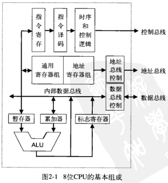
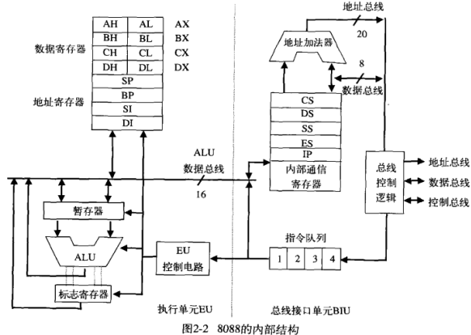
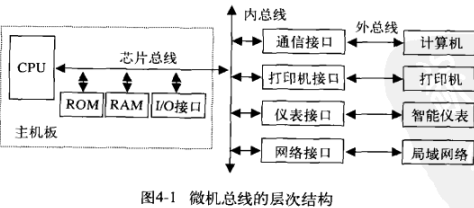

# [微机原理](https://www.bilibili.com/video/BV1ua4y1v7q3)

## 计算机基础

微型计算机是指以**微处理器**为核心，配上存储器，输入/输出接口电路等所组成的计算机。

微型计算机系统是指以**微型计算机**为中心，配以相应的外围设备，电源和辅助电路以及指挥计算机工作的系统软件所构成的系统，即微型计算机系统是由硬件和软件两部分组成。

微处理器、微型计算机和微型计算机系统三者之间有什么不同?

将运算器与控制器集成在一起，称为微处理器。
微处理器是微型计算机的核心。
微型计算机是由微处理器、存储器、输入/输出接口电路和系统总线构成的裸机系统。
微型计算机系统是以微型计算机为主机，配上系统软件和外设之后而构成的计算机系统。
三者之间是有很大不同的，微处理器是微型计算机的一个组成部分，而微型计算机又是微型计算机系统的一个组成部分。

### 冯诺依曼体系结构的基本设计思想

-   采用二进制形式表示数据和指令
-   将程序和数据存放在存储器中(程序贮存) 计算机在工作时从存储器取出指令加以执行 自动完成计算任务
-   指令的执行是顺序的
-   计算机由存储器、运算器、**控制器**(计算机控制核心)、输入设备和输出设备五大基本部件组成，并规定了5部分的基本功能。

### 微机的组成与功能

-   CPU:统协调和控制系统中的各个部件
-   系统总线:传送信息
-   存储器:存放程序和数据
-   I/O设备:实现微机的输入输出功能
-   I/O接口: I/O设备与CPU的桥梁

### 名词解释

1.  存储容量:是指CPU构成的系统所能访问的存储单元的字节数。
2.  指令:计算机能识别和执行的基本操作命令。有两种方式:机器码和助记符。
3.  指令系统:计算机所能执行的全部指令的集合，称为该计算机的指令系统。
4.  程序:为完成某一任务所作的指令(或语句)的有序集合称为程序。
5.  运算速度:计算机完成一个具体任务所用的时间就是完成该任务的时间指标， 计算机的速度越高，所用的时间越短。
6.  中央处理器(CPU) :它由运算器、控制器和寄存器3大部分组成。
7.  存储器:主要是存储代码和运算数据的。
8.  接口:是连接主机和外设的桥梁。
9.  输入/输出(I/0) 设备:
    1.  能把外部信息传送到计算机的设备叫输入设备。
    2.  将计算机处理完的结果转换成人和设备都能识别的和接收的信息的设备叫输出设备
10.  系统总线:连接各硬件部分的线路。
     1.  数据总线(DB):用来传递数据信息
     2.  地址总线(AB):用来传递地址信息
     3.  控制总线(CB):用来传递控制信息
11.  单片机:微控制器/嵌入式控制器(Embedded Controller) 简称MCU

### 数据表示

数值编码主要的两种编码方式:定点格式与浮点格式

-   定点整数:固定小数点位置
-   补码:反码+1
-   原码和反码

## 指令系统

使用**小端**

### 内部结构

微处理器的基本结构

-   算术逻辑单元ALU:负责运算
-   寄存器组
    -   通用寄存器
    -   地址寄存器
    -   标志寄存器:PSW
-   指令处理单元:负责对指令进行译码和处理
    -   指令寄存器:用来暂存被译码处理的指令。
    -   指令译码逻辑:负责对指令进行译码，通过译码获知该指令是什么功能的指令。
    -   时序和控制逻辑:根据指令要求，按一定的时序发出和接收各种信号，以便控制微机系统完成指令所要求的操作。这些信号主要有时钟信号、控制信号、请求和响应信号等。

8086/8088特点:

-   具有20条地址总线，直接寻址能力为1MB。
-   8086有16条数据总线，为16位微处理器; 8088有8条数据总线，为准16位微处理器。
-   片内总线和ALU均为16位，可进行8位和16位操作。
-   8086/8088 片内均由两个独立的裸机单元组成，即总线接口单元(BIU) 和执行单元(EU)

### 功能结构

BIU取指 EU执行

#### 总线接口单元BIU

-   4个16位段寄存器(CS、 DS、 SS、ES)
-   16位指令偏移地址寄存器(IP) ;
-   指令队列寄存器(8086CPU:6字节; 8088CPU: 4字节) ;
-   形成20位物理地址的加法器
-   与EU通讯的内部寄存器;
-   总线控制逻辑;

>   实现CPU与存储器或I/O口之间的数据传送

8088的BIU维护4字节的指令队列

#### 执行单元EU

-   16位算术逻辑单元(ALU) ;
-   16位状态标志寄存器FLAG;
-   8个16位通用寄存器组(AX,BX,CX,DX,SP,BP,SI,DI) ;
-   16位数据暂存器;
-   EU控制电路;

### 周期

-   时钟周期:时钟脉冲的重复周期称其为时钟周期(T状态) ,是CPU的时间基准，由计算机主频决定。如8086主频为5MHZ, 1 个时钟周期就是200ns。
-   总线周期: 8086CPU与外部交换信息总是通过总线进行的，CPU的周期，一般一个总线周期由四个时钟周期组成(T1、 T2、T3、T4)
-   指令周期:每条指令的执行由取指令、译码和执行等操作组成，执行一条指令所需要的时间称为指令周期。不同指令周期是不等长的，一个指令周期由一个或若干个总线周期组成。

| 周期     | 来源                                    | 关系                                                      |
| -------- | --------------------------------------- | --------------------------------------------------------- |
| 时钟周期 | 时钟脉冲的重复周期称其为时钟周期(T状态) | 由计算机主频决定。如8086主频为5MHZ, 1 个时钟周期就是200ns |
| 总线周期 | 8086CPU与外部交换信息总是通过总线进行的 | 一般一个总线周期由四个时钟周期组成(T1、 T2、T3、T4)       |
| 指令周期 | 执行一条指令所需要的时间称为指令周期    | 一个指令周期由一个或若干个总线周期组成                    |

### 寻址方式

1.  立即数寻址
2.  寄存器寻址
3.  存储器寻址(EA 有效地址)
    1.  直接寻址:
        1.  `MOV AX,[200H]` 默认使用DS
        2.  `MOV AX, ES:[200H]`
    2.  寄存器间接寻址:`[DS:][BX|SI|DI]`
    3.  寄存器相对寻址:`[DS:][SI|DI|BX+06H]`
    4.  基址变址寻址:基址寄存器(BX或BP)+变址寄存器(SI或DI)
        1.  `MOV AX, [BX+SI]`默认DS
        2.  `MOV AX, [BP][DI]`默认SS
    5.  相对基址变址寻址:上面俩杂糅
        1.  `MOV AX, [BX+DI-06H]`
        2.  `MOV AX, 06H[BX+DI]`
        3.  `MOV AX, 06H[BX][DI]`

>   EA = BX | BP+SI | DI + 8 | 16位偏移

### 8086汇编

## 8086

### 总线

-   芯片总线(chip bus):局部总线(Local Bus)
    -   大规模集成电路芯片内部 或 系统中各种不同器件连接在一起的总线
    -   用于**芯片**级互联
    -   片内总线/处理器总线
-   内总线(Internal Bus)
    -   微机系统中功能单元(模板)与功能单元间连接的总线
    -   用于微机主机**内部模块**级互连
    -   板级总线/母板总线/全局总线/系统总线
-   外总线(External Bus)
    -   微机系统与其外设或微机系统之间连接的总线
    -   用于**设备**级互连

>   总线(**半双工**)的主要功能是实现数据的传输

获得控制总线`->`发出模块地址和读写控制信号`->`完成数据传输

数据传输分四个阶段

-   总线请求和仲裁:FCFS
    -   集中仲裁:中央仲裁器
    -   分布仲裁:各主模块有仲裁器和唯一仲裁号
-   寻址
-   数据传送
-   结束

### 同步方式

保持源模块与目的模块的操作同步

#### 同步时序

总线操作的各个过程由共用的总线时钟信号控制，具有固定的时序，主控模块和受控模块之间没有应答联络信号

同步传输的总线响应速度由速度最慢的模块确定

添加一个状态信号 形成半同步传输方式

半同步时序

一个共同的总线时钟信号用作各模块部件动作的时间基准

一条等待**WAIT**信号 

### 引脚

8086/8088CPU的引脚构成

1.  8086CPU是40引脚双列直插式芯片，微处理器通过这些引脚可以和存储器、I/O接口、外部控制管理部件，以及其他微处理器相互交换信息。
2.  采用了分时复用地址/数据总线技术，减少了芯片的引脚。
3.  最小模式，在系统中只有一个处理器，所有总线控制信号都是直接由该处理器产生，此时系统中的总线接口电路被减到最少。
4.  最大模式，是相对最小模式而言的，系统中包含两个或两个以上的微处理器，其中一个是主处理器，其他的处理器是协处理器，协助主处理器工作。
5.  8086/8088CPU的最大或最小模式是由硬件决定的。是通过第33号引脚(MN/MX#)控制的。

## 存储器

单译码 双译码

### RAM

#### SRAM

触发器电路

字结构存储矩阵

$T_{RC}$ 读取周期

$T_A$ 读取时间

$T_{WC}$ 写入周期

$T_W$ 写入时间

#### DRAM

单个场效应管及其极间电容

位结构存储体

仅行地址有效刷新

### 与CPU连接

-   位扩充:扩充数据位
-   字扩充:扩充容量 用部分地址线选芯片

#### 译码

-   全译码:片选+片内
-   部分译码:部分高位地址片选
-   线选译码:一根线表示01

## I/O

输出接口有锁存环节，输入接口有缓冲环节
实际的电路常用：
输出锁存缓冲环节，输入锁存缓冲环节

### 编码

-   单独编码
-   统一编码

### 寻址

>   `IN (AL|AX), (I8|DX)`
>
>   `OUT (I8|DX), (AL|AX)`

-   直接寻址
    -   i8:8位立即数
    -   0-FFH
-   间接寻址
    -   64K
    -   DX

### 传送方式

-   程序控制
    -   无条件
    -   查询 `test al,01h;检查端口`
    -   中断
-   DMA
-   I/O处理机

### 工作方式

-   中断请求
-   中断响应
-   关中断
-   断点保护
-   中断识别
-   现场保护
-   **中断服务**
-   恢复现场
-   开中断
-   中断返回

