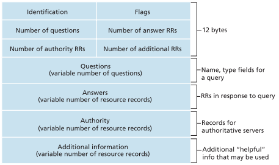
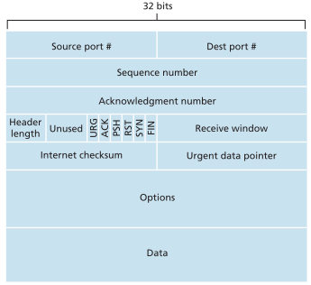
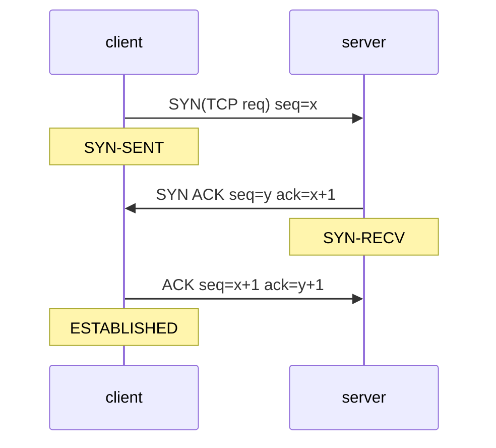
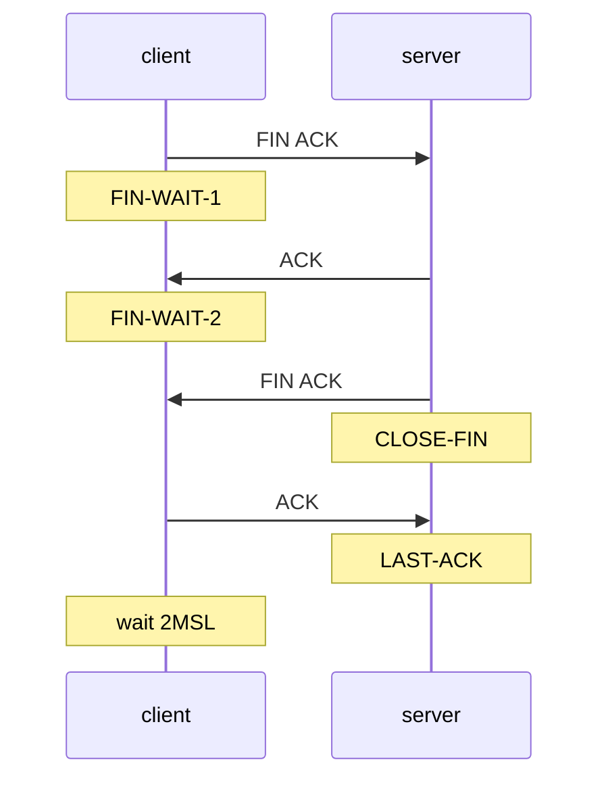
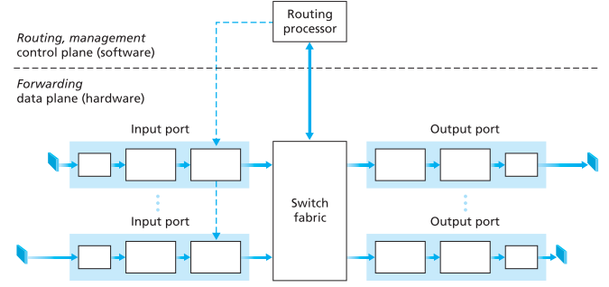
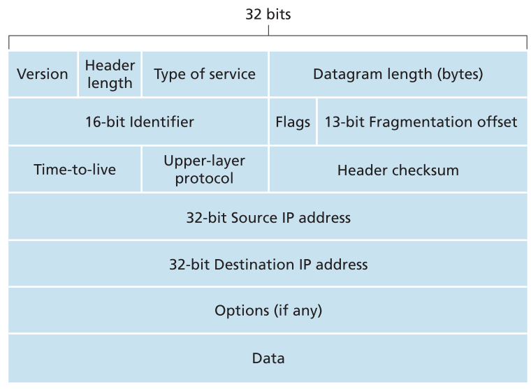
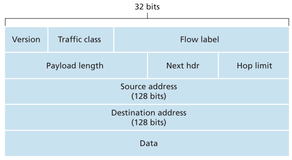
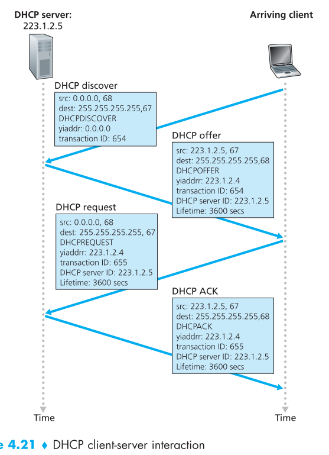

# 计算机网络

[TOC]

## 因特网

### 交换

端系统间交换报文（message）

#### 分组交换

分组

1. 存储转发 store-and-forward 存储整个分组后转发
2. 排队时延和分组丢失
3. 转发表和路由选择协议

#### 电路交换

连接

复用

1. FDM
2. TDM

### 分组交换：时延 吞吐量

| 时延类型 | 计算公式 | delay        |
| -------- | -------- | ------------ |
| 处理时延 |          | processing   |
| 排队时延 |          | queuing      |
| 传输时延 | L/R      | transmission |
| 传播时延 | d/s      | propagation  |

节点总时延 $d_{nodal}=d_{proc}+d_{queue}+d_{trans}+d_{prop}$

> 流量强度(traffic intensity):$La/R$
>
> a:分组到达队列的平均速率(**pkt/s**)

### 协议分层

TCP/IP 5层

ISO OSI参考模型 7层

| 层级   | 数据分组 | layer/payload        |
| ------ | -------- | -------------------- |
| 应用层 | 报文     | application/message  |
| 传输层 | 报文段   | transmission/segment |
| 网络层 | 数据包   | network/datagram     |
| 链路层 | 帧       | data-link/frame      |
| 物理层 | 比特     | physical/bit         |

OSI模型 open system interconnection

| 额外两层 | 作用                           | layer        |
| -------- | ------------------------------ | ------------ |
| 表示层   | 应用解释数据含义               | presentation |
| 会话层   | 数据交换定界、同步、检查、恢复 | session      |

## 应用层

### 传输服务

应用程序要求分类

1. 可靠数据传输
2. 吞吐量
3. 定时
4. 安全性

### HTTP

> **HyperText Transfer Protocol** stateless protocol :80

Web页面由对象组成

#### 连接方式

| 连接方式         | 对象处理                | 备注                                   |
| ---------------- | ----------------------- | -------------------------------------- |
| 非持续连接       | 每个请求一个单独TCP     | 每个对象耗时2RTT(TCP握手+请求) HTTP1.0 |
| 持续连接         | 所有请求一个TCP         | HTTP1.1支持                            |
| 流水线(pipeline) | 单个持续TCP连续发送请求 | HTTP1.1默认                            |

#### 报文格式

两种报文:请求/响应

- 请求行/状态行
- 首部行 header
- 空行
- 实体体 entity body

| HTTP报文首行    | 字段                     | 示例                           |
| --------------- | ------------------------ | ------------------------------ |
| 请求行(request) | 方法 URL HTTP版本        | `GET /dir/index.html HTTP/1.1` |
| 状态行(status)  | HTTP版本 状态码 状态信息 | `HTTP/1.1 200 OK`              |

##### 请求报文

请求行方法

| 方法 | 作用 | 备注 |
| ---- | ---- | ---- |
| POST | 发送相应的内容数据 | 提交表单时，则实体体包含表单的输入值|
| GET | 用于请求对象 | 提交表单时，则在请求的URL中包含输入值，如url?a&b|
| HEAD | 通常调试用 | 类似于GET，响应但不返回请求对象|
| PUT | 用于上传程序或发行 | 上传对象到指定的Web服务器的指定路径|
| DELETE | 删除Web服务器上的对象 | |

首部行的一些字段

- `Host: name` 指定对象主机地址 用于Web代理缓存
- `Connection: close` 使用非持续连接

##### 响应报文

状态码

| 状态码 | 类别                             | 原因                       |
| :----- | :------------------------------- | -------------------------- |
| 1XX    | Informational（信息性状态码）    | 接收的请求正在处理         |
| 2XX    | Success（成功状态码）            | 请求正常处理完毕           |
| 3XX    | Redirection（重定向）            | 需要进行附加操作以完成请求 |
| 4XX    | Client Error（客户端错误状态码） | 服务器无法处理请求         |
| 5XX    | Server Error（服务器错误状态码） | 服务器处理请求出错         |

首部行的字段

- `Last-Modified: _date_time` 最后更改时间

#### Cookie

cookie用于Web站点识别用户，或限制用户访问，或把内容与身份联系

cookie技术有4个组件

- 响应报文中的cookie首部行 `Set-cookie: 114` 服务器创建的cookie
- 请求报文中的cookie首部行 `cookie: 114` 浏览器保存的cookie
- 客户端保留cookie文件，由浏览器管理
- 服务端数据库，保存用户和cookie信息

#### Web cache

> proxy server

缓存最近访问的Web资源

配合CDN使用

#### conditional GET

1. 使用GET方法
2. 首部行有 `If-Modified-Since: _date_time`

通过`Last-Modified` 判断

### FTP

> File Transfer Protocol

流程

1. TCP连接
2. FTP明文登录(username+passwd)
3. 使用FTP命令

FTP使用控制连接(:21)和数据连接(:20) 带外传输(out-of-band)

### Email

电子邮件系统3个主要部分

- 用户代理
- 邮件服务器
- **简单邮件传输协议(Simple Mail Transfer Protocol)**

#### SMTP

> 7bit ASCII 表示 :25

**邮件不会存留在中间邮件服务器**

一个push协议

- 代理 push 邮件服务器
- 邮件服务器之间 push

#### MIME

> Multipurpose Internet Mail Extensions
>
> 多用途互联网邮件扩展类型

#### POP3

> Post Office Protocol-Version3 :110

- 授权
- 事务处理
- 更新

用户代理模式:下载并[删除|保留]

#### IMAP

> Internet Mail Access Protocol

- 把每个报文与一个文件夹联系起来
- 维护IMAP会话的用户状态信息
- 允许用户代理获取报文组件的命令

### DNS

> domain name -> IP :53

通常被其他应用层协议使用

DNS的重要服务

- 主机别名
- 邮件服务器别名
- 负载分配

#### DNS分层

- root

- TLD
- authoritative
- [local]

> DNS两种查询方式耗时相同

#### DNS RR

Resource Record

> RR:(Name, Value, Type, TTL)

Name和Value取决于Type

| Type  | Name            | Value                      | 记录           |
| ----- | --------------- | -------------------------- | -------------- |
| A     | 主机名          | IP                         | 映射           |
| NS    | 域(Name System) | 权威服务器主机名           |                |
| CNAME |                 | 主机对应的规范主机名       | 主机别名       |
| MX    |                 | 邮件服务器对应的规范主机名 | 邮件服务器别名 |

> 对于某特定主机
>
> 权威服务器存储其A记录
>
> 其他类型的存储NS记录和其A记录

#### DNS报文

DNS:查询/回答报文 格式相同

标识符 2B 标识查询

标志位 1bit(查询/回答)

| 区域 | 内容                     |
| ---- | ------------------------ |
| 问题 | 正在查询的信息:Name Type |
| 回答 | 对最初请求名字的资源记录 |
| 权威 | 其他权威服务器记录       |
| 附加 | 其他有帮助的记录         |

### P2P vs C/S

> 分发时间:N个对等方都获得该文件副本所需时间

$$
D_{c/s}=\max\{\frac{NF}{u_s},\frac F {d_{min}}\}\\
D_{p2p}=\max\{ F/u_s, F/d_{min}, NF/u_{total} \}
$$

## 传输层

传输层协议为应用程序提供了逻辑通信功能

### 多路复用与多路分解

> 所有计算机网络都需要

| 多路分解                             | 多路复用                             |
| ------------------------------------ | ------------------------------------ |
| demultiplexing                       | multiplexing                         |
| 将运输层报文段数据交付到正确的套接字 | 收集套接字数据封装传输层首部到网络层 |

> TCP:四元组标识<LIP,LPort,RIP,RPort>
>
> UDP:二元组标识<RIP,RPort>

### UDP

> IP+复用/分用+差错检测

#### 首部

8B首部

| 2B                   | 2B         |
| -------------------- | ---------- |
| 源端口号             | 目的端口号 |
| 长度(整个报文段长度) | 检验和     |

校验和:带上伪首部的16bit带回卷的加法

#### 伪首部

| 32   | bit                   | source      | IP     |
| ---- | --------------------- | ----------- | ------ |
| 32   | bit                   | destination | IP     |
| 0    | 8bit Protocol(UDP:17) | 16bit       | length |

### rdt

#### 1.0

> 背景:完全可靠信道

#### 2.0

> 具有比特差错信道

> ARQ:自动重传协议
>
> - 差错检测
> - 接收方反馈 ACK/NAK

停等协议

问题:ACK/NAK的差错

#### 2.1

> 2.0+ACK/NAK受损

增加1bit序号来判断是否重传

对于 失序的分组发送ACK

#### 2.2

无NAK

使用冗余ACK替代NAK

#### 3.0

> 丢包的 比特差错信道

使用倒计数定时器(countdown timer)

**比特交替协议**

### pipeline

> 信道利用率:发送比特时间/发送时间

> 发送窗口大小最大为序号一半

#### GBN

滑动窗口协议

| 基序号 base        | 下一个序号 nextseqnum |
| ------------------ | --------------------- |
| 最早未确认分组序号 | 下一个代发分组序号    |

事件响应

- 上层调用
- 收到ACK:累计确认
- 超时

丢失乱序分组

#### SR

仅重传出错分组

### TCP

全双工服务 点对点连接

建立连接:3次握手

拆除连接:4次挥手

> MSS(Maximum Segment Size) `MSS=MTU-TCP_Header-IP_Header`  **TCP payload**
>
> MTU(Maximum Transmission Unit) 最大链路层帧长度 **data-link payload**

TCP Segment=message+TCP header

#### segment

options:用于协商MSS 用作窗口调节因子等

#### timeout

RTO(Retransmission TimeOut)即重传超时时间

估计往返时间，以设定超时间隔

- 样本SampleRTT为某报文段从发出到ACK收到的时间，(大多数TCP)仅在某时刻测一次不重传的段
- TCP维持EstimatedRTT作为均值，每次获得新SampleRTT都会按如下更新：
  $EstimatedRTT=(1-\alpha)EstimatedRTT+\alpha SampleRTT$，$\alpha$常为0.125
- EstimatedRTT是每个SampleRTT的指数加权移动平均，越近的权重越高
- 也常用RTT偏差DevRTT估算Sample和Estimated偏离的程度，是差的EWMA：
  $DevRTT=(1-\beta)DevRTT+\beta |SampleRTT-EstimatedRTT|$

超时初始1s

超时间隔应大于RTT以避免不必要重传，波动大则留足的余量大，因此采用如下公式
$TimeoutInterval=EstimatedRTT + 4\cdot DevRTT$

#### 流量控制

> 消除发送方使接收方缓存溢出的可能性

维护接收窗口(receive window)

- RcvBuffer表示接收方缓存区总大小
- LastByteRead表示从缓存读出的最后一个字节的编号
- LastByteRcvd表示已放入缓存的最后一个字节的编号

> $LastByteRcvd-LastByteRead\leq RcvBuffer$

接收窗口 $rwnd=RcvBuffer-[LastByteRcvd-LastByteRead]$

接收方把rwnd值放入给发送方的报文段中，使发送方知道可用空间

发送方需保证 $LastByteSent-LastByteAcked \leq rwnd$

> rwnd为0会锁死发送方，因此发送方不断试探发送1Byte报文段，在响应中获取新rwnd

#### 连接管理

三路握手

四路挥手

#### 拥塞控制

> 防止网络拥塞

还追踪**拥塞窗口**(congestion window)

让发送方感知网络拥堵

丢包定义:

- 超时
- 3个冗余ACK

##### Reno

1. 慢启动SS 初始值为MSS ACK RTT后指数增长
   1. 丢包时 记录 ssthresh 为 cwnd/2
   2. 3个冗余ACK则快速重传
   3. 超过sshresh 则 进入拥塞避免
2. 拥塞避免CA 每次ACK RTT后增加一个MSS
   1. 收到3个冗余ACK则把ssthresh设置为cwnd的一半 进入快速恢复
3. 快速恢复FR 
   1. Tahoe 没有FR 对于3个冗余ACK和丢包一样处理
   2. 对每个ACK  增加一个MSS
   3. 有新ACK则进入拥塞避免
   4. 超时则进入慢启动

#### 吞吐量

- 平均吞吐量$\frac{0.75W}{RTT}$
- 带丢包的平均吞吐量为$\frac{1.22MSS}{RTT\sqrt L}$

### 拥塞控制

- 端到端
- 网络辅助的拥塞控制
  - ATM 采用VC处理分组交换
  - 使用choke packet来通知拥塞

## 网络层

> 路由和转发

网络服务模型

- 服务模型
- 带宽保证
- 丢包保证
- 有序性
- 定时
- 拥塞指示

| 网络体系结构 | 服务模型       | 带宽保证     | 丢包 | 有序 | 定时 | 拥塞指示   |
| ------------ | -------------- | ------------ | ---- | ---- | ---- | ---------- |
| Internet     | 尽力而为       | 无           | 有   | 无   | 无   | 无         |
| ATM          | CBR 固定比特率 | 恒定         | 无   | 有   | 维护 | 不出现拥塞 |
| ATM          | ABR 可用比特率 | 保证最小速率 | 有   | 有   | 无   | 有         |

### 虚电路

> Virtual Circuit 连接服务网络

ATM 帧中继等

在网络层使用连接

虚电路 VC号 路由器维持连接状态信息

#### 虚电路阶段

1. 虚电路建立
2. 数据传送
3. 虚电路拆除

> 信令报文 信令协议(signaling)

### 数据报

> 无连接服务网络

路由器使用**最长前缀匹配**转发分组

> 转发:分组在**单个路由器**从入到出
>
> 路由选择:涉及一个网络的所有路由器

### 路由器工作原理

通用路由器体系结构

4部分

- 输入端口:(Input Port 从外到内)
  - 执行物理链路相连的物理层功能
  - 执行入链路的数据链路功能
  - 完成查找功能
- 交换结构:网路路由器中的网络
- 输出端口
  - 存储从交换结构接收的分组
  - 执行功能
- 路由选择处理器:执行路由选择协议

#### 输入端口

使用DRAM SRAM或者三态内容可寻址存储器TCAM

#### 交换结构

- 内存交换
- 总线交换
- 互联网络交换

#### 输出端口

无内存导致丢包

#### 排队与调度

吸收流量负载的波动 缓存数量 B=RTT$\times$链路容量C

大量TCP流的缓存 $B=RTT\cdot C/\sqrt N$

> 分组调度程序(packet scheduler) 可以保障QoS
>
> - FCFS
> - WFQ 加权公平排队

分组丢弃和标记的策略:**AQM 主动队列管理**算法

随机早期检测(Random Early Detection)是一种AQM实现

### IP

#### v4数据报格式

**标志位**

- 保留
- DF(Don't Fragment)
- MF(More Fragment)

| 标志位\标志 | 1          | 0               |
| ----------- | ---------- | --------------- |
| DF          | 禁止分片   | 允许分片        |
| MF          | 非最后一片 | 最后一片/未分片 |

**偏移**:单位8B

**上层协议**:指定IP数据报上层给的传输层协议

- 6:TCP
- 17:UDP

分片计算公式
$$
d=floor(\frac {MTU-20} 8)*8\\
n=ceil(\frac {L-20} d)\\
    len =
        \begin{cases}
        L-(n-1)d, & \text{last fragment} \\
        d+20,  & \text{others} \\
        \end{cases}
$$

#### v4编址

> 点分十进制

##### 分类编址

| 类别 | 前缀 | 网络号位数 | 私有地址       | 网段个数 |
| ---- | ---- | ---------- | -------------- | -------- |
| A    | 0    | 8          | 10.x.x.x/8     | 1        |
| B    | 10   | 16         | 172.16.x.x/12  | 16       |
| C    | 110  | 24         | 192.168.x.x/16 | 256      |
| D    | 1110 |            | 多播地址       |          |
| E    | 1111 |            | 保留地址       |          |

##### CIDR

> 无分类域间路由选择(Classless Inter-Domain Routing)

`a.b.c.d/x`

#### v6

> **40B**首部 引入任播地址 不允许分片

冒号十六进制

可以零压缩

- 4个0简写为一个
- 连续0用冒号替代

#### v6 to v4

- 双栈协议  dual-stack
  - 同时启用IPv4和IPv6
  - 协议降级重填v4
  - 经过IPv4时 可能会丢失部分信息(比如流)
- 隧道技术  tunneling
  - 协议重包装
  - 将IPv6数据报放入IPv4报文中

#### IPsec

安全网络层协议 面向连接

**运输模式**

1. 主机间建立连接
2. IPsec加密传输层数据段并添加安全性字段
3. 封装进IP数据报

### DHCP

> 动态主机配置协议(Dynamic Host Configuration Protocol)

~~**yiaddr**表示你的IP地址~~

DHCP 四步骤 **全广播**

1. DHCP Server discover
   1. UDP:67 广播
   2. DHCP discover message 发现报文
2. DHCP Server offer
   1. 收到发现报文
   2. DHCP  offer message 提供报文
   3. 事务ID, IP, mask, lifetime(IP租用期 lease time)
3. DHCP request
   1. 选择一个后发送请求
   2. DHCP request message
   3. 回显配置参数(如上提供信息)
4. DHCP  ACK
   1. 响应请求
   2. DHCP ACK message
   3. 证实请求参数(再发一遍)

### NAT

- 静态地址转换(static NAT)
- 动态地址转换(dynamic NAT)
- 端口多路复用(Port Address Translation) ~~应该一般用的这个~~

### ICMP

网络层3个主要组件:IP协议 路由选择算法  ICMP

被主机和路由器用于沟通网络层信息 **差错报告**

ICMP报文承载在IP分组中

`traceroute` `tracert`等程序一次发送三个相同TTL的ICMP报文

### 路由选择

#### 路由选择算法

| 分类               | 算法             | 实现基础         | 问题     |
| ------------------ | ---------------- | ---------------- | -------- |
| 全局路由选择算法   | 链路状态(LS)算法 | Dijkstra算法     | 振荡     |
| 分散式路由选择算法 | 距离向量(DV)算法 | Bellman-Ford方程 | 无穷计数 |

#### 层次路由选择

层次路由重要原因

- 规模 scale
  - LS难更新
  - DV难收敛
- 管理自治 administrative autonomy
  - 运行自己的算法
  - 隐藏内部结构

通过自治系统(Autonomous System)解决

> AS+AS内部路由选择协议(intra-autonomous system routing protocol)+AS间路由选择协议(inter-autonomous system routing protocol)

网关(gateway)处理inter|intra-AS的路由器

AS间路由协议处理内容

- 从相邻路由器获取可达性信息
- 向AS内路由器传播可达性信息

> 热土豆路由选择(hot potato routing) AS尽快/尽可能经济传播分组~~只管下一个~~

#### 因特网路由选择

- AS内部 interior gateway protocol
  - RIP
  - OSPF
- AS间
  - BGP

##### RIP

> Routing Information Protocol

- 使用DV算法
- 用跳数(hop)作为费用测度
- 最大跳数 **15** 用于下层ISP和企业网中
- 使用 **RIP 响应报文**(UDP:520)
  - 大概30s交换一次
  - 180s无通信认为死亡

| 目的子网 | 下一台路由器 | 到目的地跳数 |
| -------- | ------------ | ------------ |
| z        | C            | 4            |

##### OSPF

> Open Shortest Path First

- 使用LS算法 Dijkstra
- 用于上层ISP
- 使用OSPF报文(protocol:89)
  - 自己实现rdt等功能
  - 直接交付IP
- 优点
  - 安全
  - 多条相同费用的路径
  - 支持单播 多播
  - 支持 AS

一个OSPF AS可以配置成多个区域

- 每区域运行自己的 OSPF LS算法
- 区域内部广播LS
- 区域边界路由器向外提供路由选择
- 只有一个OSPF 主干(backbone)区域:为AS间区域提供路由选择

##### BGP

> Border Gateway Protocol 半永久eBGP TCP:179

BGP为AS提供了以下工作的手段

- 从相邻AS处获得子网可达性信息
- 向本AS内部所有路由器传播这些可达性信息
- 基于可达性信息的AS策略，确定到达子网的好路由

BGP对等方(BGP TCP连接:BGP  session)

- 跨越AS 外部BGP(eBGP)
- AS内部 内部BGP(iBGP)

BGP中的目的地是CDIR化的前缀

> gateway 使用eBGP外部通讯 使用iBGP内部广播

BGP中的AS使用ASN唯一标识

特殊的桩(stub)AS没有ASN 仅承载源或目的地址是本AS的流量

路由器通过BGP会话通告一个前缀

前缀包含**BGP属性**(路由 route)

- AS-PATH
  - 包含前缀的通告已经通过的AS(过一个加一个)
  - 检测和防止循环通告
- NEXT-HOP
  - 开始于路由器接口
  - 用于配置转发表和热土豆
  - 最好路径的AS外的第一台路由器IP

BGP通过**输入策略(import policy)**决定通告处理(接收/过滤)

> BGP路由选择规则
>
> 1. 本地偏好(设置或学习到)
> 2. 选择最短AS-PATH
> 3. 最靠近NEXT-HOP的路由(热土豆)
> 4. BGP标识符

桩网络(stub network) 只会是起点和终点的AS

通过控制通告控制转发

> 路由选择策略:防白嫖

AS路由选择的参考因素

- 策略
- 规模
- 性能

## 链路层

链路层设备称为结点(node) 通信信道称为链路(link)

链路层主体在网络适配器/网络接口卡(network adapter/network interface card)

### 差错检测和纠正

> Error-Detection and Correction EDC

#### 奇偶校验

奇偶校验位parity bit

一维奇偶校验 50%检错

二维奇偶校验 一位纠错

**前向纠错(Forward Error Correction FEC)** 接收方检测和纠错

#### checksum

数位和回卷取反码

#### CRC

> Cyclic Redundancy Check 循环冗余检测

异或除法

r+1比特的生成多项式

D(data)+R(CRC比特)

### 多路访问

网络链路

- 点对点链路 PPP/HDLC
- 广播链路 Ethernet/WLAN

广播信道共享问题:多路访问问题

> **多路访问协议**
>
> - 信道划分协议(channel partitioning)
> - 随机接入协议(random access)
> - 轮流协议(taking-turns)

协议简单 分散(去中心化)

#### 信道划分

- TDM 时分复用
- FDM 频分复用
- CDMA 码分多址 给结点分配编码

#### 随机接入

每个结点可以占满信道

碰撞重发 会有重发时延

##### slotted ALOHA

> 划分时隙 只能在时隙开始时发送
>
> 碰撞后以概率*p*在之后每个时隙重发 直到成功

slotted ALOHA效率为 $Np(1-p)^{N-1}$  最大值为$1/e=0.37$

##### ALOHA

不分时隙 立即传输

最大效率为 $1/2e$

##### CSMA

> 载波侦听多路访问(Carrier Sense Multiple Access)/碰撞检测(Collision Detection)

1. 发送前先侦听是否占用
2. 发送过程中侦听
3. 碰撞则二进制指数退避(binary exponential backoff)

效率近似公式   $1/(1+5d_{prop}/d_{trams})$

#### 轮流

##### polling

轮询协议

指定主结点 以循环的方式轮询结点

##### token-passing

令牌传递协议

传递一个称为**令牌token**的特殊帧 发送者持有令牌

### 交换局域网

链路层交换机交换数据帧 使用链路层地址

### ARP

> Address Resolution Protocol : 子网内 IP 转 MAC

ARP表存储在主机和路由器中~~即插即用~~

| IP              | MAC               | TTL      |
| --------------- | ----------------- | -------- |
| 222.222.222.222 | 22-22-22-22-22-22 | 12:45:00 |

在子网广播ARP查询分组

匹配者(比较IP)发送ARP响应分组

> 跨子网的数据报发送先得到路由器MAC后发给路由器再查询后转发

#### MAC

> NIC拥有MAC地址

链路层地址称呼

- LAN address
- physical address
- MAC address

6B

`FF-FF-FF-FF-FF-FF` 广播地址

前3B为公司 后3B公司定义

### Ethernet

集线器(hub)用于放大信息 后被交换机(switch)取代

#### frame

| 前同步码Preamle | 目的地址 | 源地址 | 类型 | 数据         | CRC           |
| --------------- | -------- | ------ | ---- | ------------ | ------------- |
| 8Bytes          | 6B MAC   | 6B MAC | 2B   | 46-1500Bytes | 32bits/4Bytes |

Preamble : 

- 前7B`10101010` 用于唤醒接受适配器 同步时钟
- 最后1B`10101011` 

CRC校验不通过则抛弃

### switch

过滤:决定转发或丢弃

转发:决定导向的接口

借助交换机表完成

| MAC               | interface | 时间TTL |
| ----------------- | --------- | ------- |
| 12-34-56-78-90-12 | 1         | 9:32    |

switch table 三种情况

- 没有的MAC地址 向非源接口广播
- 只有MAC和对应的源接口项 丢弃
- 有不同于源接口的接口关联则转发

#### self-learning

1. 初始为空
2. 对于入帧 存储信息
   1. MAC
   2. 源接口(入帧到达交换机的接口)
   3. 当前时间
3. 老化

#### 性质

- 消除碰撞
- 隔离异质线路
- 管理

| 交换机选择 | 交换机                                            | 路由器                        |
| ---------- | ------------------------------------------------- | ----------------------------- |
| 优点       | 即插即用 过滤转发速率高                       | 分层次 防火墙保护广播风暴 |
| 缺点       | 生成树防止广播循环 大网络大ARP表 广播风暴 | 人为配置 处理时间更长     |

## 缩写

|  缩写  |                      全称                      |          中文          |
| :----: | :--------------------------------------------: | :--------------------: |
|  ISP   |           Internet Service Provider            |    因特网服务提供商    |
|  IETF  |        Internet Engineering Task Force         |    因特网工程任务组    |
|  RFC   |              Request For Comment               |        请求评论        |
|  API   |       Application Programming Interface        |    应用程序编程接口    |
|   CO   |                 Central Office                 |         中心局         |
|  DSL   |            Digital Subscriber Line             |       数字用户线       |
| DSLAM  |  Digital Subscriber Line Access Multiplexer ?  |  数字用户线接入复用器  |
|  HFC   |               Hybrid Fiber Coax                |      混合光纤同轴      |
|  CMTS  |         Cable Modem Termination System         | 电缆调制解调器端接系统 |
|  FTTH  |               Fiber To The Home                |        光纤到户        |
|  AON   |             Active Optical Network             |      主动光纤网络      |
|  PON   |            Passive Optical Network             |      被动光纤网络      |
|  ONT   |           Optical Network Terminator           |     光纤网络端接器     |
|  OLT   |            Optical Line Terminator             |     光纤线路端接器     |
|  LTE   |              Long Term Evolution               |        长期演进        |
|  UTP   |            Unshielded Twisted Pair             |      无屏蔽双绞线      |
|   CC   |                 Coaxial Cable                  |        同轴电缆        |
|  FOC   |              Fiber Optical Cable               |          光纤          |
|  LEO   |               Low-Earth Orbiting               |        近地轨道        |
|  FDM   |        Frequency-Division Multiplexing         |        频分复用        |
|  TDM   |           Time-Division Multiplexing           |        时分复用        |
|  PoP   |               Point of Presence                |         存在点         |
|  IXP   |            Internet Exchange Point             |      因特网交换点      |
|  VoIP  |          Voice over Internet Protocol          |         IP语音         |
|  PDU   |               Protocol Data Unit               |      协议数据单元      |
|  ISO   | International Organization for Standardization |     国际标准化组织     |
| OSI/RM |  Open System Interconnection/Reference Model   |  开放系统互连参考模型  |
|  DDoS  |         Distributed Denial-of-Service          |   分布式拒绝服务攻击   |
|  ISDN  |      Intergrated Service Digital Network       |     综合业务数字网     |
|  CS   |                    Client-Server                    |      客户端-服务器       |
|  P2P  |                    Peer-To-Peer                     |      对等体到对等体      |
|  TCP  |            Transmission Control Protocol            |       传输控制协议       |
|  UDP  |               User Datagram Protocol                |      用户数据报协议      |
|  SSL  |                Secure Sockets Layer                 |       安全套接字层       |
|  WWW  |                   World Wide Web                    |          万维网          |
| HTTP  |             HyperText Transfer Protocol             |      超文本传输协议      |
|  RTT  |                   Round-Trip Time                   |         往返时间         |
|  CDN  |            Content Distribution Network             |       内容分发网络       |
|  FTP  |               File Transfer Protocol                |       文件传输协议       |
| SMTP  |            Simple Mail Transfer Protocol            |     简单邮件传输协议     |
| MIME  |        Multipurpose Internet Mail Extensions        |   多用途互联网邮件扩展   |
| POP3  |           Post Office Protocol - Version3           |      第三版邮局协议      |
| IMAP  |          Internet Message Access Protocol           |    因特网邮件访问协议    |
|  DNS  |                 Domain Name System                  |         域名系统         |
|  TLD  |                  Top Layer Domain                   |          顶级域          |
|  TTL  |                    Time To Live                     |         生存时间         |
|  RR   |                   Resource Record                   |         资源记录         |
| ICANN | Internet COrporation for Assigned Names and Numbers | 因特网名字和地址分配协议 |
|  DHT  |               Distributed Hash Table                |       分布式散列表       |
| TCP  |     Transmission Control Protocol      |   传输控制协议   |
| UDP  |         User Datagram Protocol         |  用户数据报协议  |
|  IP  |           Internet Protocol            |     网际协议     |
| rdt  |         reliable data transfer         |   可靠数据传输   |
| udt  |        unreliable data transfer        |  不可靠数据传输  |
| ARQ  |        Automatic Repeat reQuest        | 自动重传请求协议 |
| FSM  |          Finite State Machine          |    有限状态机    |
| ACK  |        positive Acknowledgment         |     肯定确认     |
| NAK  |        Negative Acknowledgment         |     否定确认     |
| GBN  |               Go-Back-N                |     回退N步      |
|  SR  |            Selective Repeat            |     选择重传     |
| MSS  |          Maximum Segment Size          |  最大报文段长度  |
| MTU  |       Maximum Transmission Unit        |   最大传输单元   |
| EWMA | Exponentially Weighted Moving-Average  | 指数加权移动平均 |
| ATM  |       Asynchronous Transfer Mode       |   异步传输模式   |
| ABR  |           Available Bit Rate           |    可用比特率    |
|  RM  |       Resource Management (cell)       |  资源管理(信元)  |
| EFBI | Explicit Forward Congestion Indication | 显式转发拥塞指示 |
|  CI  |         Congestion Indication          |     拥塞指示     |
|  NI  |              No Increase               |      无增长      |
|  ER  |             Explicit Rate              |     显式速率     |
|  SS  |               Slow Start               |      慢启动      |
|  CA  |          Congestion Avoidance          |     拥塞避免     |
|  FR  |             Fast Recovery              |     快速恢复     |
| AIMD |    Add-Increase, Multiply-Decrease     |   加性增乘性减   |
| CBR  |          Constant Bit Rate          |      恒定比特率      |
| ABR  |         Available Bit Rate          |      可用比特率      |
|  VC  |           Virtual Circuit           |        虚电路        |
| TCAM |    Tenary Content Address Memory    | 三态内容可寻址存储器 |
| FCFS |       Firse Come First Serve        |      先来先服务      |
| WFQ  |        Weighted Fair Queuing        |     加权公平排队     |
| AQM  |       Active Queue Management       |     主动队列管理     |
| RED  |       Random Early Detection        |     随机早期检测     |
| HOL  |          Head Of the Line           |    线路前部(阻塞)    |
| TOS  |           Type Of Service           |       服务类型       |
| TTL  |            Time To Live             |       存活时间       |
| MTU  |      Maximum Transmission Unit      |     最大传输单元     |
| CIDR |    Classless Interdomain Routing    |  无类别域间路由选择  |
| DHCP | Dynamic Host Configuration Protocol |   动态主机配置协议   |
| NAT  |     Network Address Translation     |     网络地址转换     |
| SOHO |      Small Office, Home Office      |   小型/家庭办公室    |
| UPnP |       Universal Plug and Play       |     通用即插即用     |
| ICMP |  Internet Control Message Protocol  |  因特网控制报文协议  |
| VPN  |       Virtual Private Network       |     虚拟专用网络     |
|  LS  |             Link State              |       链路状态       |
|  DV  |           Distance Vector           |       距离向量       |
|  AS  |          Autonomous System          |       自治系统       |
| RIP  |    Routing Information Protocol     |   路由选择信息协议   |
| OSPF |      Open Shortest Path First       |    开放最短路优先    |
| BGP  |       Border Gateway Protocol       |     边界网关协议     |
| ASN  |      Autonomous System Number       |      自治系统号      |
|   PPP   |     Point-to-Point Protocol     |      点到点协议      |
|   MAC   |      Medium Access Control      |     媒体访问控制     |
|   NIC   |     Network Interface Card      |      网络接口卡      |
|   EDC   | Error Detection and Correction  | 差错检测和纠正(比特) |
|   FEC   |    Forward Error Correction     |       前向纠错       |
|   CRC   |     Cyclic Redundancy Check     |     循环冗余检测     |
|  HDLC   |  High-level Data Link Control   |   高级数据链路控制   |
|   FDM   | Frequency-Division Multiplexing |       频分复用       |
|   TDM   |   Time-Division Multiplexing    |       时分复用       |
|  CDMA   |  Code Division Multiple Access  |       码分多址       |
|  CSMA   |  Carrier Sense Multiple Access  |   载波侦听多路访问   |
| CSMA/CD |    CSMA / Congestion Dection    |   带碰撞检测的CSMA   |
|   ARP   |   Address Resolution Protocol   |     地址解析协议     |